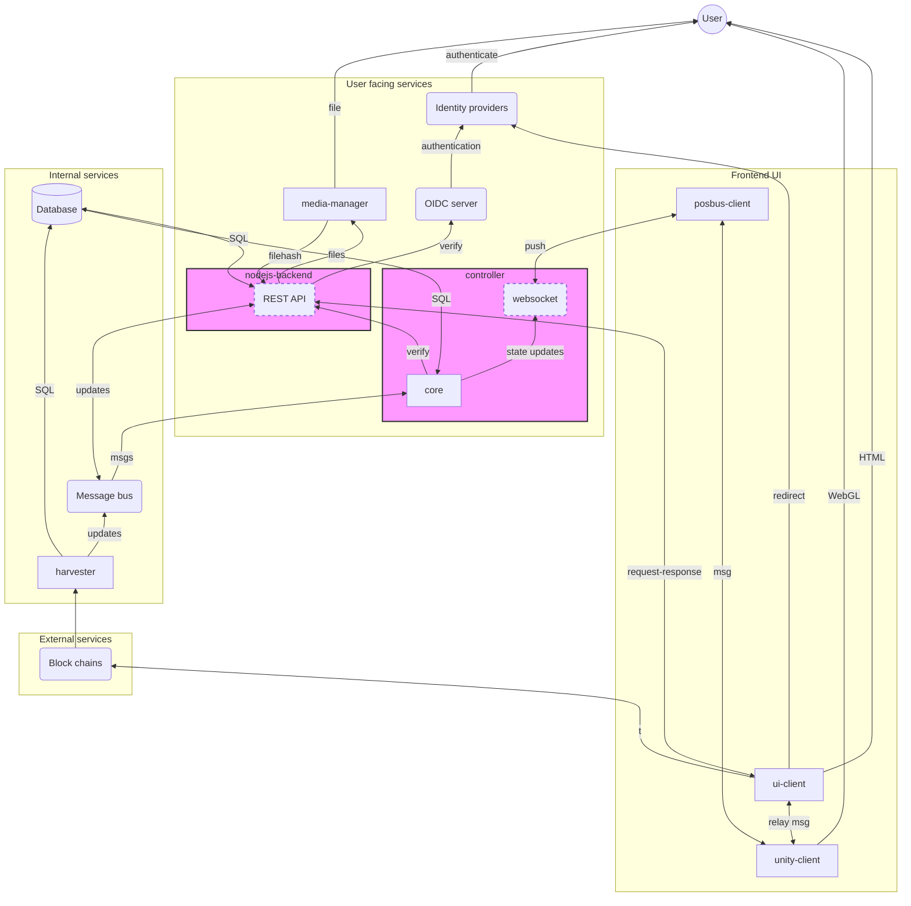
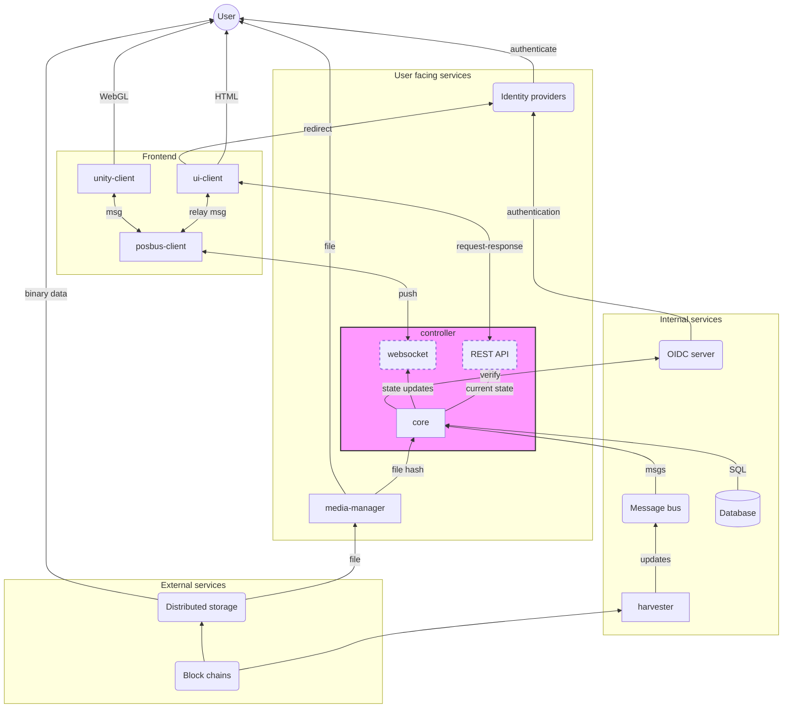

The different separate components of the software stack and how they interact with each other.

## Frontend
Software components that run in the user's browser.

### UI-client
Main (2D) user interface.
A React application. Runs in the user's browser.
It loads [unity-client](#unity-client).

- Sends and receives events/action from unity-client
- Sends and retrieves actions/data from momentum API
- Retrieves (push) messages from Controller (posbus)
- Redirects to authorization service for authentication
- API calls to identity providers for login
- API calls to blockchain(s) (polkadot.js)

### Unity-client

3D user interface.
Unity engine, compiled as WASM, renders to WebGL canvas.
Runs in user's browser
- Sends and receives messages from the Controller, through posbus
- Sends and receives events/actions from [ui-client]

## Public services
Services that are 'publically' accessible.

### Identity providers
OIDC login and consent applications.
Based on [Ory Hydra].
Reads browser session state (cookies).
- Redirects users to a login page, which is implemented in [ui-client]
- API calls to [OIDC Authorization Server](#oidc-authorization-server)

### OIDC authorization server
Instance of [Ory Hydra]. Manages the authentication session tokens.
- User/browser gets redirected to it.
- Read browser session state (cookies).
- Redirects to login/consent pages in [ui-client].
- Receives API calls from [Identity providers] to create authentication sessions.
- Receives (private) API calls from API and controller to verify authentication tokens.

### Odyssey API
HTTP JSON API.
- Receives calls from [ui-client]
- Receives token (JWT) verification calls from controller
- Receives and sends messages from MQTT
- Queries (SQL) the database
- API calls on media-manager to store files
- API calls authorization server to verify tokens

### Controller
Custom (binary) protocol to push real time updates through a WebSocket.
- Sends and receives messages from unity-client
- Calls Momentum API to verify tokens (JWT)
- Receives and sends messages from MQTT
- Queries (SQL) the database

### Media manager
Service to manage storing (large) binary files/data uploaded by users.
- Receives calls with a file from Momentum API, returns a unique hash ID
- Sends files to frontends (e.g, 3D textures, music files or avatar images)

### InfluxDB
Store time-series data, used for collecting historical usage data.
- Receives calls from the Controller
- Provides data to Grafana

## Private services
Services that are only accessible in the software stacks internal networking.

### Message bus
Asynchronous communication bus between services.
- Sends and receives (and optionally stores) messages from API, controller and harvester

### Database
Persistent storage for the state of worlds.
- Receives queries (SQL) from controller and Momentum API
- Stores data on storage provided by the hosting environment

### Harvester
Read/monitor blockchains and provide this data in consistent format for consumption by other services.
- Receives on-chain data
- Send messages to the message bus
- Stores temporary data in the database

[ui-client]: #ui-client
[Ory Hydra]: https://www.ory.sh/hydra/

