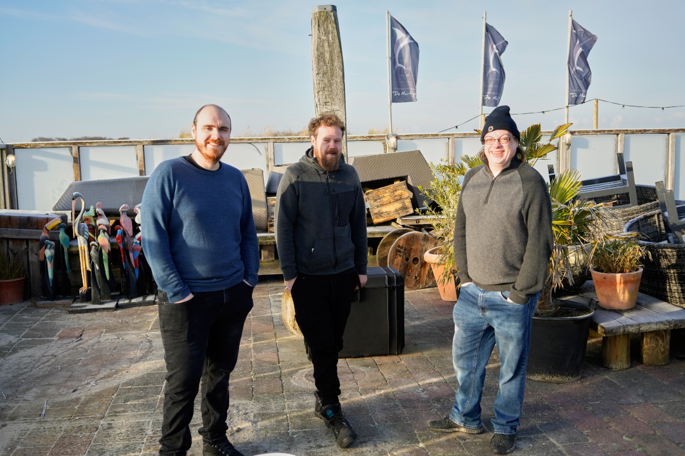
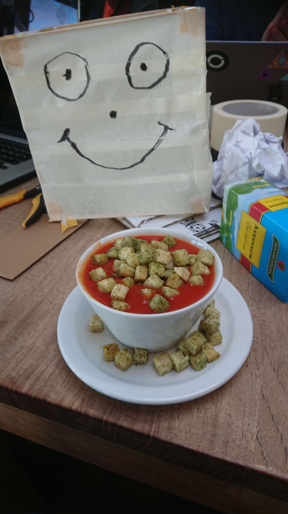
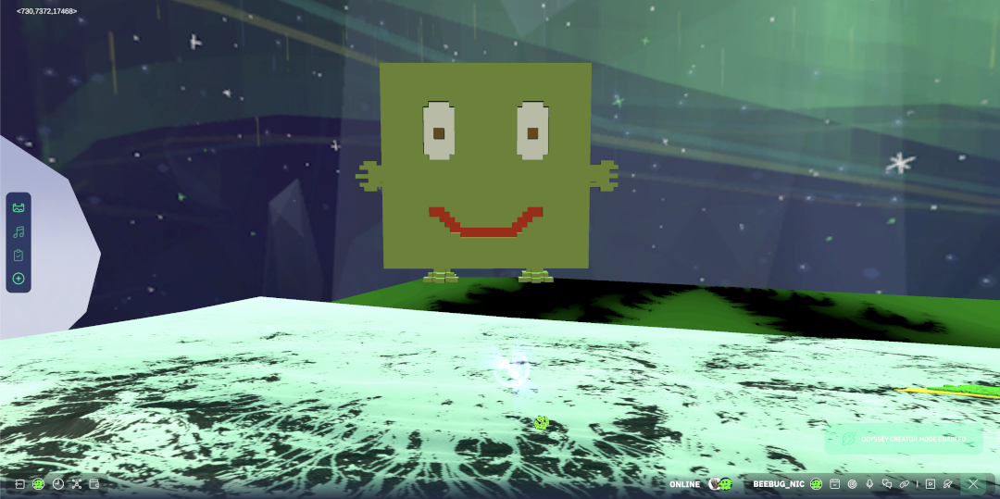

# Cubey: A phygital object that blurs the boundaries between two worlds

At the end of last year, the whole Odyssey team gathered in person on the stunning island of Schiermonnikoog (hard to spell, even harder to say!).  Freezing temperatures, frosty sand, a chilling wind and snow and ice awaited us—but that didn’t matter. We were in the warm, doing what comes natural to us: **having a hackathon**.

The project that my team was working on is a subject that is very close to my heart: bringing the real world and the metaverse together. The combination of the digital and the physical is an incredibly powerful concept, and exploring its various facets is something I find fascinating.

In a nutshell, we wanted to create a physical object (Cubey) that could interact with an Odyssey in a non-intrusive way. Something with a digital twin in your Odyssey that you could keep next to your TV or on your bedside cabinet to perform casual interactions within the metaverse (e.g. high-five someone who enters your Odyssey, or return a staking someone just made in your world). In other words, a [phygital](https://www.forbes.com/sites/forbesbusinesscouncil/2021/06/30/phygital---what-is-it-and-why-should-i-care/) entity to bridge the gap between the physical and digital worlds without the need to use screens.

The project is open source, and at the end of the article you’ll find how to help further its development.

<!--truncate-->

## How the idea was born

We were extremely fortunate to have Olav from [WERC Collective](https://werccollective.com/werc-studio/) on our team—an amazing artist and electronics expert. We had previously worked together on the MetaTree project during the [Sovereign Nature Initiative Hackathon](https://medium.com/@myodyssey/sovereign-nature-initiative-winter-hackathon-challenge-2022-creating-technology-at-the-service-of-af4070a1fa03) (getting live data from trees into the metaverse for monitoring the health of forests), and his expertise and talents are always incredibly handy.

But how do we go about combining the physical and the digital? After some intense brainstorming outside (it’s amazing how quickly you can come to a consensus when it’s -3C 🥶), we came up with a simple concept that resonated well with the entire team. **We wanted to encourage casual interaction between the physical world and the digital**.

<figure>

<figcaption>The Cubey team having their standup in the freezing cold</figcaption>
</figure>

It was important to us that this interaction should feel natural and be non-intrusive, something that could sit next to your TV and you could choose to ignore. For this reason, we rapidly discounted anything that would contain a screen—a screen almost demands attention and would feel very intrusive. After role-playing some interactions, we hit on the idea of ‘the cube’: **a simple cube-like device with sensors and LEDs which could communicate statuses from the digital world to the physical one, as well as relay sensor information back into the digital**. Something you could hold (and maybe even hug), and move around without worrying about cables and connections.

And following the indie gamedev adage that adding cute giant eyes to everything makes a product infinitely better, we decided to give the cube a personality—and thus Cubey was born.

<figure>

<figcaption>Cubey, with googly eyes, having breakfast</figcaption>
</figure>

## What’s inside Cubey?

We used one of the modified sensors we had built for the MetaTree project, and added a light sensor, gyroscope, and several rings of LEDs to act as status indicators. The idea became more and more tangible as we combined the electronics within a case. And, quite seriously, drawing the eyes onto the cube itself turned out to be a fairly important step—we had turned some electronics and a cardboard box into something that people wanted to interact with.   

With the hardware sorted, the next big step was the software—establishing two-way communication between Cubey and an Odyssey development environment we had set up specifically for the project. The first part of the functionality was reading in data from the light sensor and using that light data to illuminate a cube (a digital representation of the real Cubey) inside an Odyssey.  It was incredibly cool to see a dynamic light source casting shadows and getting brighter and darker as we covered Cubey with a coat, or exposed him to the low hanging sun.

<figure>

<figcaption>Digital representation of Cubey inside an Odyssey</figcaption>
</figure>

The next step was actually even more exciting: we hooked up the gyroscope inside Cubey to a 3d object that existed inside an Odyssey.  After some tinkering—including crashing the development environment several times (turns out electronic components send data INSANELY quick), we had a neat bit of functionality working: moving and rotating the physical Cubey resulted in the 3d model mirroring those rotations inside the Odyssey in real time. Cubey could not only answer yes and no questions without touching a keyboard, but he could even mosh and flip around in both the metaverse and the real world at the same time! 

Alas, due to time constraints (we had 48 hours to work on the project), we didn’t get the final bit of functionality working, which was communication from an Odyssey to Cubey. We went as far as getting Cubey to flash when we simulated an event (such as a high-five or a login), happening in an Odyssey.

<figure>

<figcaption>Testing Cubey's light sensors</figcaption>
</figure>

## The outcome of the project

The logical consequence of this was to ask ourselves: what if you were sitting on your sofa and Cubey flashed green to show someone on your friends list had logged into your Odyssey? What if it flashed yellow to indicate that someone had staked into your Odyssey—and maybe, by giving Cubey a hug, you could return the staking and form a connection with the person. So many possibilities!

As mentioned, exploring the digital and physical interactions that can occur between the real world and the metaverse is an exciting (and constantly evolving) area. This post covers what was possible within a two-day hackathon, but there is so much more to explore—and it’s not just humans that could interact with the digital world: animals, plants and even the planet itself could.

## How you can participate in Cubey

The rapidly blurring boundaries between the real world and the metaverse is a fascinating field, and if you are interested in joining us in exploring these boundaries, then please get in touch—I’m always incredibly eager to talk to folks about the metaverse! Feel free to reach out to me on Discord (Beebug_Nic#3644) or on Twitter ([@beebug_nic](https://twitter.com/BeeBug_Nic)). 

As of now, Cubey is out of scope for the current iteration of Odyssey. Fortunately, the entire Odyssey stack is open source, so if you are feeling curious, why not set up a development environment and hook some real life sensors to the metaverse? We’d love to help you carry on this project.

Finally, a huge shout-out to Olav from the WERC Collective for joining us during this hackathon.