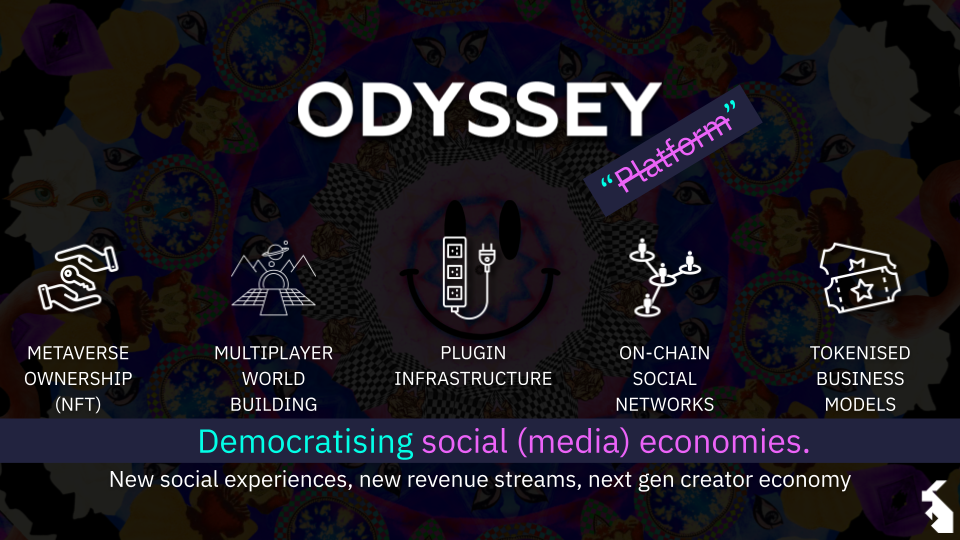
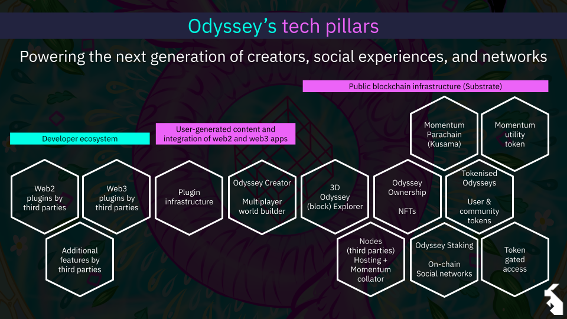

# Welcome to Odyssey, the web 3D social medium for novel metaverse experiences 

Odyssey empowers you to create and take part in experiences that would be impossible otherwise (in both the physical and digital worlds). Are you ready to jump in?

Imagine, a gathering of 1,000 people without having to travel; not a static voice and camera interaction, but an experience where everyone can truly participate ([learn more about use cases further down](#use-cases)).

At Odyssey, we want to democratise social (media) economies. In the Odyssey network, each user has their own 3D world, their Odyssey, and they can build it with custom assets and implement their own tokenomics.

In this article, we'll explain what the above statement entails, what led us to create Odyssey, how it is different from other metaverses (and social media), and what’s in store for the future.

In short, the current iteration of Odyssey is the natural consequence of what we learnt on our journey so far—the synthesis of the way we imagine the metaverse, social media, social interactions, collaboration, value creation, and digital experiences in a decentralised, open-source paradigm.

No time to read the article? Read the introduction in our [docs](https://discover.odyssey.org/), or [flip through our deck](https://docs.google.com/presentation/d/e/2PACX-1vQeOBc0JvY5xCZxq83sFT3t_Nw8YJEFbjlMEvX1NSef1_s1Fkmp0bDfcmF_9CPIg7_FQTYpthH7U5I5/pub?start=false&loop=false&delayms=3000)

Let’s dive into the rabbit hole.

<!--truncate-->

## Why Odyssey?

Humans live 3D lives, but our communication (social media) is 2D. This limits the way we express ourselves, interact, connect, and experience things online. 

The Metaverse allows us to explore and create the 3D experiences we can't experience in the physical reality. For example, hosting a concert with thousands of people that cannot travel to our location.

Furthermore, if we look at our digital identity today, we see a lot of fragmentation. Twitter is the place where we chitchat, LinkedIn is where our professional life goes, Facebook is for friends and hobbies. Building and maintaining different social profiles is becoming increasingly difficult, and the natural result is that **social media can only give a superficial image of who we are**. Also, most social media don't generate value directly, not from what we post, and not from the connections we make.

From these considerations—and from our experience with web3, 3D metaverses, and on-chain technologies—we are building a social medium which is fully owned by its users, where each "profile" is a full 3D world where you can interact with, build new adventures in, and express yourself freely. More than that, **Odyssey is a decentralised platform where connections are valued and rewarded with a utility token, Momentum ($MOM)**.

### Let’s give some numbers

Gaming metaverses had 400 million MAU (Monthly Active Users). Non-gaming metaverses (like Odyssey) are still scratching the surface, with less than 1 million MAU (Meta itself has less than 200k users). Why is that?

Because **the majority of metaverses are trying to apply a new technology (the metaverse) to an old paradigm (web2)**. Let’s compare web2 and web3 metaverses, it will be clear why web2 metaverses are not appealing.

| Web3 metaverse | Web3 Metaverse |
|--------------|--------------|
| Social content media | Social activity media |
| Maximising screen time | Maximising value (creation) |
| Co-consuming | Co-creating |
| Platform-centric | User-centric |
| Centralized server| Network, nodes owned by users |
| Closed source | Open source |
| Closed garden | Open, interoperable, anyone can innovate |
| Business economics | Token economics |
| Not programmable, only shareholders benefit | Programmable, all token holders benefit |
| Assets (and data) owned by platform | Assets (and data) owned by users |
| Tech and experience dominated by platform | Tech and experience co-created by ecosystem |

**The value generated in the Odyssey network circles back to the network participants, it doesn’t go in the pockets of the shareholders**.

## What's in the box?

We are building Odyssey from the ground up, there is still a lot of road to cover, and **our vision will be heavily shaped by the users**. Nonetheless, these are some of the things that are available, or will be in the coming months.

### Odyssey Creator, the world builder

With Odyssey, you have the freedom to create your own 3D world on-chain. You own it, and you can put anything you want in it. You can:

- Spawn custom 3D objects
- Modify objects (scale, move, rotate)
- Assign objects functions (e.g. displaying images, text, videos, Miro boards, or Google Docs)
- Change skyboxes (the backdrop image that surrounds your world)

### Collaboration and communication

You can invite people to your Odyssey, and make it easy to co-create together:

- Organise events and put them in the calendar
- Use voice, text, and video chat to make communication seamless

### Get rewarded and reward your favourite creators

Odyssey has a built-in Connections system, which is based on the web3 concept of staking. You can connect to another Odyssey and earn rewards in $MOM token. You will also be rewarded when people connect with you.

We are also working on token-gated access, which will allow you, for example, to grant exclusive access to your Odyssey to token holders only. The token-gating mechanism will enable numerous business models, like subscriptions, and ticket-based access.
## Future features

We are still in the early stages, but we aim to achieve our vision through three pillars:

1. The Odyssey Creator (which you can already experience)
2. A plugin infrastructure (to empower everyone to add custom functionalities to their Odyssey)
3. The Momentum token (to generate value from what you build and from your connections)

The two images below exemplify what’s coming better than many words.

To summarise, what’s coming is an open-source, decentralised stack where every user **owns** their own metaverse, can modify it to their liking, and can implement their own business model. All independently of the platform itself. All that Odyssey does is giving everyone the tools to do that.

## Everyone is an Odyssey

Our MVP (Minimum *Lovable* Product), is still green, and we would like your help and feedback to make it mature.

We invite you to create your Odyssey on [odyssey.org](https://odyssey.org) (instructions [here](https://discover.odyssey.org/create-your-odyssey/the-birth-process/)), and join our [Discord](https://discord.gg/6PH9nSu7UP) server to share both your feedback and what you built.

We'd love for you to be a part Odyssey. Let's continue to push the boundaries and explore the endless possibilities of the metaverse together!

- This is a list of what you can currently experience in your Odyssey
- Mint your Odyssey as NFT
- Your Odyssey appears in the 3D block explorer
- Enter your Odyssey and fly!
- Set your skybox (background)
- Add objects
- Shape the objects
- Add functionality to those objects
- Connect to other Odysseys by staking
- Earn staking rewards
- Mutual stakers are friends and can build their Odysseys together
- Talk through the voice chat while building
- Schedule a moment you want to do something together in your Odyssey
- Publish to the timelines
- High five a fellow traveller and connect

## A Brief History of Odyssey

The Odyssey team was known for organising some of the biggest blockchain-themed hackathons in Europe. But when COVID-19 struck, we were forced us to shift gears and adapt to the new reality. That's when we first pivoted, and decided to bring the hackathon experience online, creating a 3D platform where people could come together and collaborate remotely. To our surprise, the virtual hackathons were a huge success, and we realized the potential for even more immersive and interactive online experiences.

This is when the idea for Momentum was born, and we pivoted a second time. We envisioned a 3D representation of the Kusama ecosystem, where every project and validator could have their own space, complete with customisation functionality, live-streaming, chat, and collaboration tools. Then, we delved deeper into the metaverse, we soon realized that we were acting as mere gatekeepers, limiting the true potential of the metaverse we had created...

At this moment we made a third pivot, and decided to let go of that gatekeeping role and empower anyone to own their own 3D world, connect to other worlds, co-create new experiences together, and ultimately become whole on the internet again. And thus, the new iteration of Odyssey was born.

## Use cases

The following are just two of the many examples we could give on how to use an Odyssey:

**You are an NFT artist**. Display your artwork in a 3D environment, hold auctions, sell your work both within the Odyssey and outside. More than that, hold events and gatherings for art enthusiasts, or even events where you co-create unique art pieces with other artists (for example, through a plugin that integrates Magma, just like we integrated Miro).

**You are in a band**. You can live cast your gig in your Odyssey, and let thousands of people that cannot be there in person enjoy your concert, but also participate by posting pictures, or interact with you via voice chat. With the right implementation, even experience the show with VR. After the concert, you could give access to the recording through your community token, or even mint your formidable guitar solo for your fans to hold as an NFT.

Here is a sneak peek of the current user experience in Odyssey:

