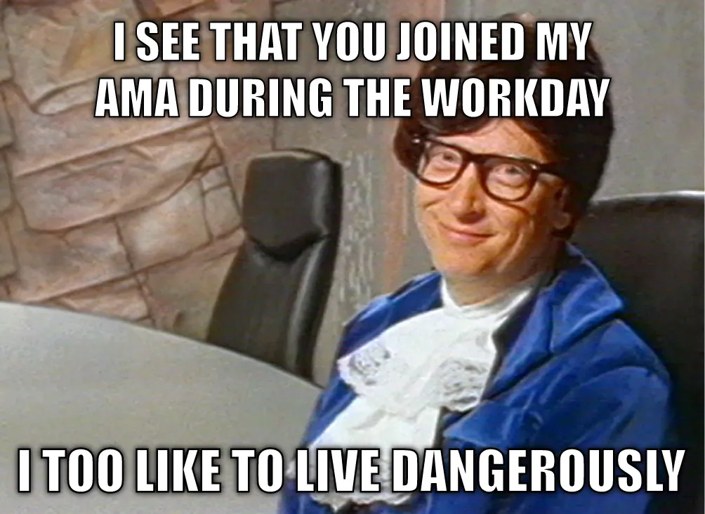
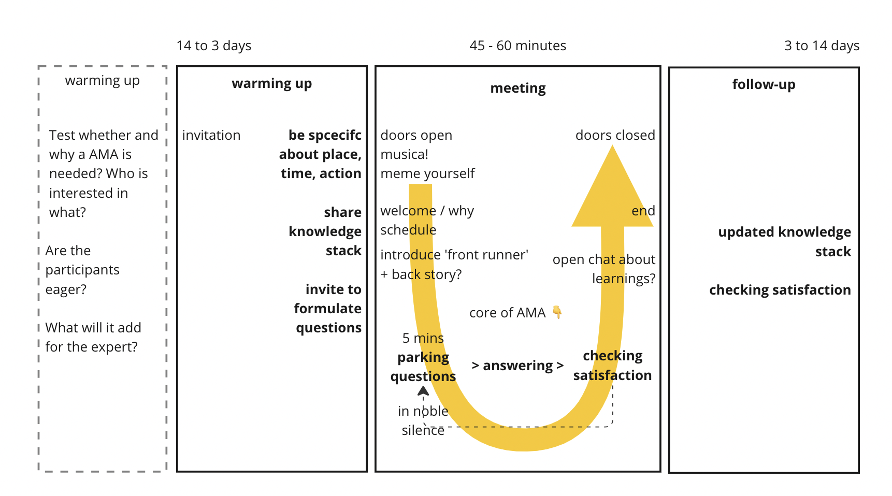
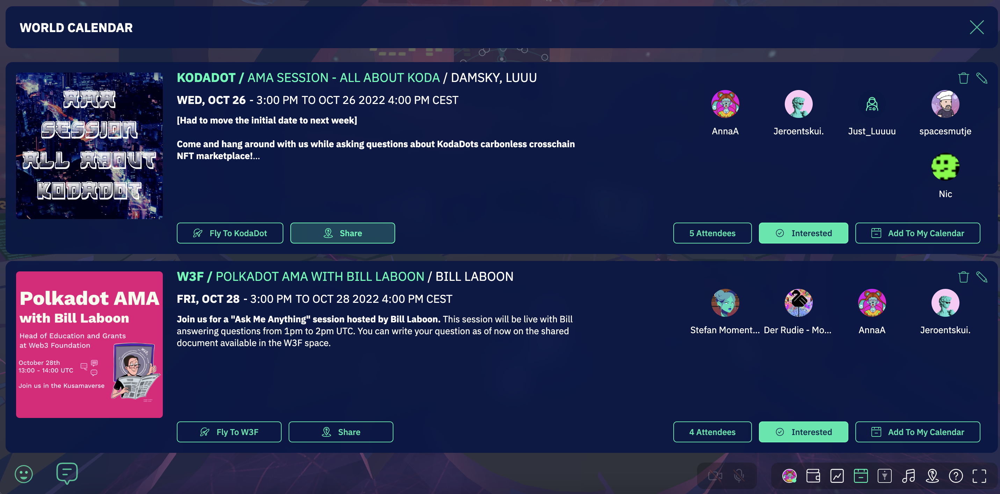
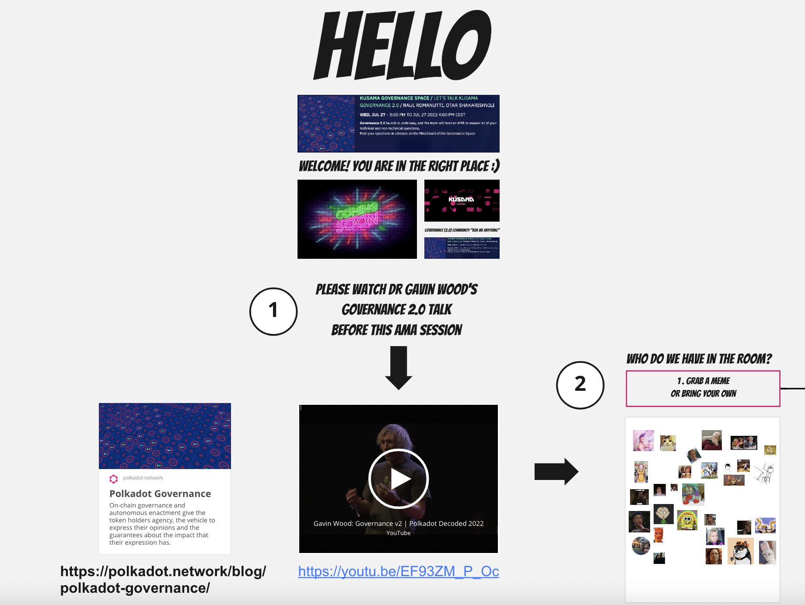
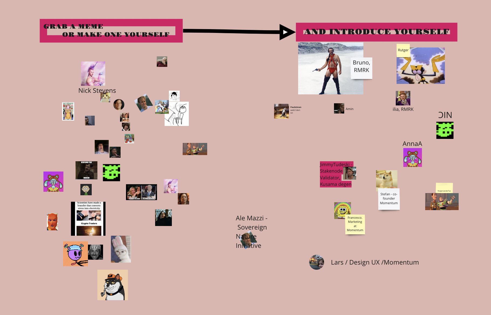

# AMA (Ask Me Anything) session

**How to run an AMA session - the Odyssey method**

**Let’s learn together! So, Ask Me Anything…**

[Odyssey](https://odyssey.org/) is building Momentum, an open source web3 metaverse stack, serving to unlock the collaborative superpowers of humanity. At Odyssey we believe in the power of web3 / open source / sharing. This is why we share – almost – all our knowledge (and not just only about the tech stack) and invite others to use it, to test it and build on top of it. 

Our favourite way of knowledge sharing and creation is by hosting Ask Me Anything sessions to share our source knowledge and invite others to ask clarifying questions on whatever needs clarification. At Odyssey we love to learn together, create together, help each other forward and… have fun. We are [Human After All](https://youtu.be/PXYeARRyDWk).

In this article, we’ve gathered both our theory and best practices for hosting AMA sessions using the available Momentum features, such as collaborative tools like Miro, Google Docs, as well as Stage Mode, Screen sharing and Video/Audio. 

Please feel welcome to ask any questions :-)

**An Ask Me Anything Session? 👇**

An Ask Me Anything session is a public, user focussed, highly interactive **session about a specific subject, where people can attend to ask anything, and get answers. **

The goal: knowledge sharing, **knowledge creation, and… increasing the collaborative power of the network / humanity.**

As a bonus, AMA sessions are a **great way to connect with your community, including users and stakeholders.**

**Role of every participant** in achieving this result.
**Host** - facilitating the process, the session,
**Helper** - capturing answers/notes on document/Miro/…,
**Front runner / knowledge provider** - 1. providing content (up front and in the session), and 2. answering the questions, 3. bring the stack of knowledge further afterwards.
**Participants** - preparing and asking clarifying questions.

What will happen after a session? **Upgrade of knowledge stack, by adding the answers to the stack.**

Do you need help to prepare or chair your AMA? Great! Get in [Ritzo](https://twitter.com/ritzotencate) (design) and/or [Nick](https://twitter.com/Clogish) (host)!

**What does a typical AMA look like? Flow and Program.**

Screen grab from [Miro](https://miro.com/app/board/uXjVPcMDtS4=/?moveToWidget=3458764536205613676&cot=14).

**Pro-tips.**

**Formulate a crystal clear goal and name it in the invitation / topic of the session.**
To host a successful AMA - you need to have a **really clearly defined goal** for the session. Without this, your AMA will likely feel like cHaOs. To think about your goal, these questions will help:

Why are you really hosting this AMA?
What do you want to get clear in this session?
What do you want the participants to get out of the session?
What will the participants be able to do differently after the AMA?
What change has happened, or will be happening that requires this AMA?

**Make the goal of your session the topic of the AMA itself**, so that it is clear to everyone. Example: ‘Ask My Anything for black belt hosts on hosting a 100+ user session in Miro.’

A very broad topic can attract many people. But you will want to make sure that your **audience is more or less on the same page** when it comes to their level of knowledge of the topic and their experience. By being clear about the goal and knowledge stack you will create a filter. Otherwise you will end up with complete newbies asking basic questions in a technical deep dive, and… having highly technical people being bored.

It might be an option to split up your AMA into a newbies session and a Jedi levels session.

**Get your AMA Session right and clear in the calendar of the participants**

For all Invitations and promotion, the goal is to get into the calendar of people. Otherwise there is a high chance people will not show up.

Provide every information you have available to indicate why people should care and join: who is the front runner / knowledge provider; the time, date and location and links to location, pre-reading etc. For example, use the ‘Magic Link’ to get a direct link to your space in Momentum, where you will be hosting an AMA session, and share it with the participants.

Use the ‘doors open’ and ‘doors closed’ times in the invitation to be sure that everyone is in on time. A session starts after 3-5 minutes of listening to somehow meaningful music with a very warm welcome.

Create the invitation with attention AKA granularity. It will increase the number of highly engaged participants.

**Share the knowledge stack upfront with the participants**

Create a low threshold Miro-board, Google Doc, Wiki entry or whatever to share the knowledge on what the AMA is going to be about.

Don’t expect all participants to have reviewed all content thoroughly, but be sure that at least a few of them can be on the level of asking valuable questions.

**Test whether and why a session is wanted. And consider retrieving questions upfront.**

If no one is truly waiting for answers, don’t AMA. Test it by inviting participants to formulate questions up front and even provide them before the AMA starts.

Depending on the type of topic, participants and session, you might want to ask for questions to be submitted in advance of a live session. Guiding people to a well designed Miro board is a great way to capture these questions up front. This also gives you time to research the answers before the live session.

**An AMA of 45 to 60 minutes works great.**

Our experience is that 45 to 60 minutes is the ideal duration for an AMA session. Less than this, and you’ll probably not get everything done. More than this becomes a burden on your participants' ability to concentrate (human bodies start switching off already after 20 minutes of being in a session – within 75 minutes your body is in hibernation).

**Tuesday and Thursday after school times (1500+) are great.**

To pick the most suitable time and day to host a session - consider the participants. If they are mostly working people, Monday 9am or middle of the day might not be the best option. Tuesday-Thursday afternoon between 3 and 5pm are usually safer options. Friday afternoon is a terrible time, if you really want to combine it with beer hours, Thursday evening is time to go!

**Have an arrival / start activity so that people can immediately start to be interactive (and don’t tune out / get some final work done in the meantime)**

Encourage them to start this activity as soon as they arrive. Our favourite is **“who is in the room”** where people introduce their name and company/role on the board and **select a meme** that resonates with them.

**Start a session with warm welcome, why and how the Q&A will work and front runners / knowledge providers**

1. Warm welcome! Make connection.
2. Why are we here? 
3. Explain how the session will work, particularly how, when and where people can add their questions. We suggest that people can ask questions any time, by adding them to a note on the miro board. Answers will come later.

Then introduce the front runner(s) / knowledge provider(s), and if relevant, have them provide the back story or other content. Keep this short, maximum 15 minutes.

**Cancelled or rescheduled the AMA? Inform the community**

If the AMA session has been cancelled or rescheduled for some reasons, informing the participants and community about these changes is the least you could do. Send out a message to all participants using their favourite channels and broadcast your message on all social media channels where this event was promoted.
