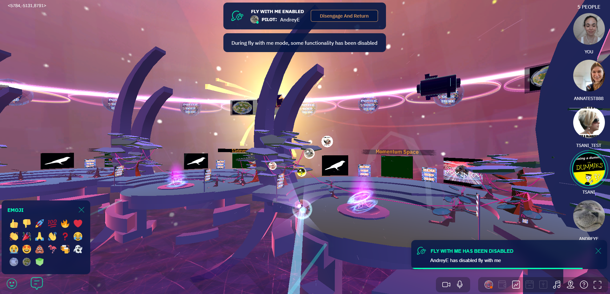
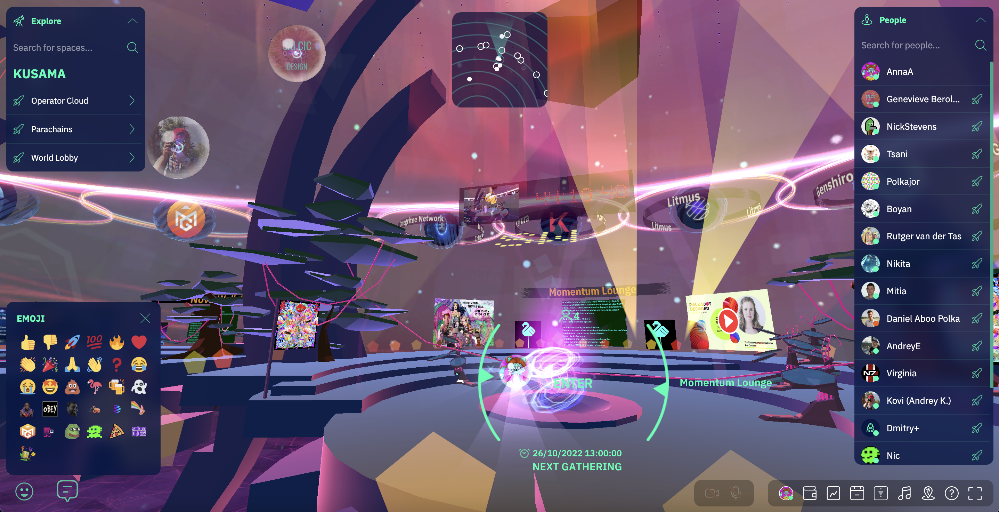
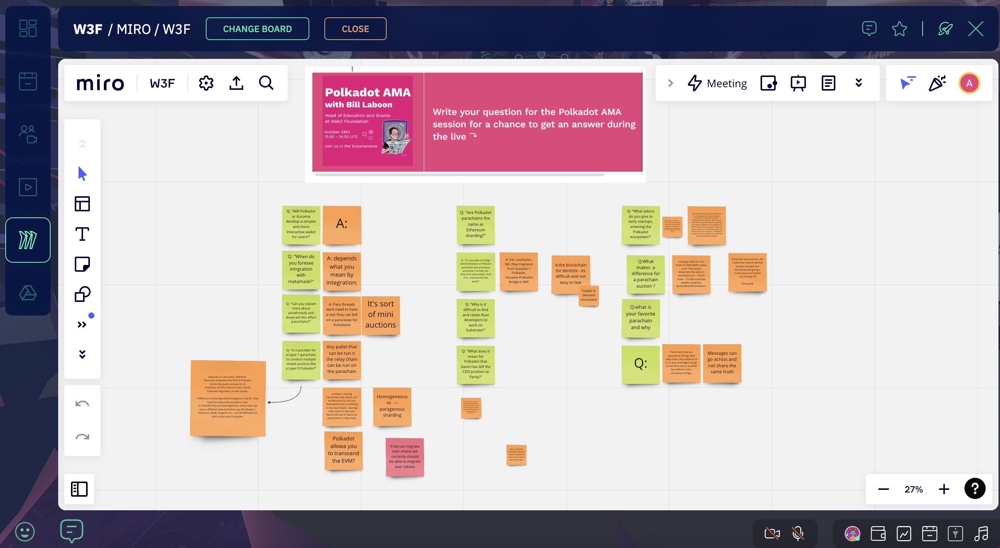
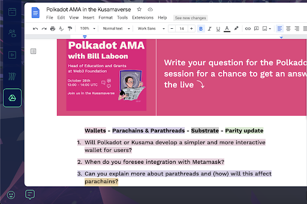
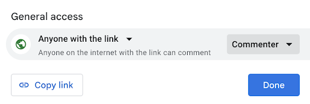
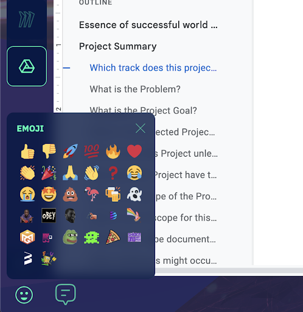

# How do I use the Momentum features in my AMA?

Generally speaking, *Ask Me Anything / AMA* sessions in a digital environment are linear audio (think of a radio show), linear text (think of a forum or chat) or a video calling. 

All of these forms of AMA are not catering for giving a majority of the participants an active role during the session; most of us are familiar with chaos being just around the corner with massive interactive (online) sessions.

Momentum is a ~~metaverse~~ collaboration tool designed to enable everyone to contribute. In this article we share how to keep on the right end of being in between order and chaos and… we help you how to set up your AMA for maximum participation.

Enjoy unlocking the superpowers of large numbers of participants of your AMA.

Want to read more about AMA’s? We wrote an [entire article](https://myodyssey.medium.com/how-to-run-an-ask-me-anything-ama-session-the-odyssey-method-2e654ddee822) on how to run one.

**0\. Before you start: Fly with Me**

With the Fly with Me feature, you can add some engagement right at the start of your AMA session by inviting your audience to join you on a guided tour around the 3D environment.

As an Admin of the space, you can toggle on Fly with Me mode directly from the top of your dashboard to become a Pilot, and - together with other users - fly around Momentum while staying in the audio/video chat.

This works especially well if people joined your Momentum space through the direct Magic link, and are not yet familiar with what’s outside of the 2D dashboard. This way, you can show them around and explain what else they can see and do in the 3D space.

**1\. Using Collaboration mode or Stage Mode**

Depending on the number of participants - use ‘normal’ collaboration mode or Stage mode.

When you enter a space, you immediately end up in the audio/video chat with other users and are able to start collaborating at once.

**If you are with 5-10 people** it might be valuable to use ‘normal mode’ and to keep the mics on for everyone to unmute themselves and ask questions when time comes. This creates a really nice round table feeling.

**If you’re with 10+ people, or you need more control, use Stage Mode instead.** In Stage Mode, you can invite your speakers on stage with video and audio. Everyone in the audience is automatically muted. Audience members with questions can ask them in the chat, and you can bring them on/off stage.

Please note: only users with Admin rights can toggle on Stage Mode through the left menu bar by enabling it on top left of the screen.

When Stage Mode is on, everyone flying around Momentum can also enjoy special visual effects coming from the space without entering it. This appears to be a great way to attract even more attention from users online!

**2\. Chat vs Miro board vs Google Doc**

Each space in Momentum has an integrated Space Chat functionality, which keeps the message history permanent so it doesn't disappear when the gathering is over and/or when everyone leaves the space.

**Text chat can be a good way to ask questions, if the session doesn’t have too many participants.** The downside is that questions, and answers, end up in a stream of text (and can easily get lost).

**We use Miro** as a convenient way to capture the questions, and get them answered live during the AMA. It creates a sort of a repository that you can use later on to share with the community or even publish a blog with the questions-and-answers as a follow-up.

You can add a Miro board in Momentum on the left menu bar.

Please note:
Miro is an integrated tool in Momentum, so in order to add your Miro board in the Momentum space you would need your own Miro account.

If you prefer a more text based approach, adding **questions as comments to a Google Doc** is an alternative option to capture the answers to questions during your AMA session.

Add a Google Document in Momentum from the left menu and give ‘anyone with the link’ commenter rights, so they can assist you in capturing content.

**3\. Encourage fun with Emojis**

There’s nothing quite like seeing a stream of hearts at the perfect time. Encourage it and you’ll brighten up your AMA.♥️

People in Momentum space can react with Emoji throughout the entire AMA session, to express their emotions and show their engagement with the front runner and the topic. If a minimum of 10 users react with the same emoji - a MEGAmoji effect will be triggered ;)

Emojis can be found right in the bottom left of Momentum. 👇

**4\. Stage mode + Chat + Miro board or Google Doc + Emojis can be used at the same time!**

This is where the power of Momentum really comes to life. Our absolute favourite technique is to use Stage Mode, enable our participants to chat and use a Miro board and emote all at the same time, in one browser tab. Maybe that sounds like a lot, but it’s really intuitive, your audience will pick it up in minutes.

