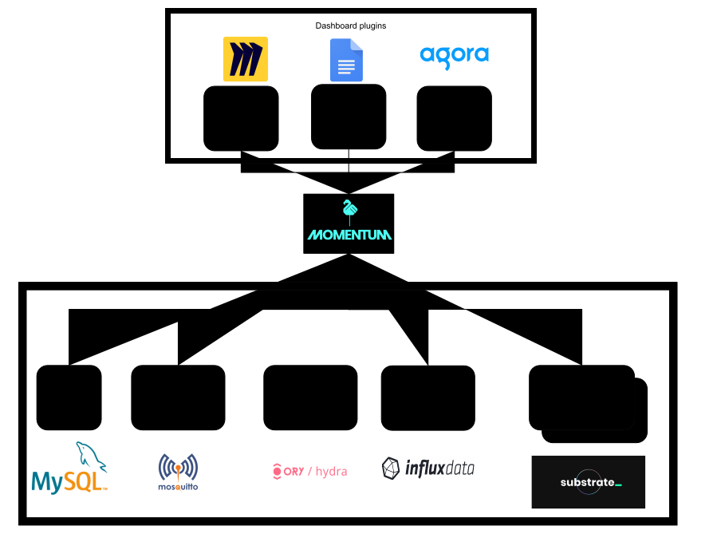

# Third party services

The Odyssey stack depends on a couple of other applications that are created and maintained by third parties.

## Frontend

The Odyssey stack makes use of several external online services to provide collaboration tools inside Odyssey dashboards. All these are commercially available tools, delivered/used as ‘Software-As-A-Service’.[^1]

#### [Miro](https://miro.com/online-whiteboard/)

Online collaboration on a whiteboard.

#### [Google Docs](https://www.google.com/docs/about/)

Online collaboration on various types of documents.

[Agora](https://www.agora.io)

Online collaboration with voice, video and text chat.

## Backend

The Odyssey stack depends on running several applications that are created by third party organisations. All of them are open-source and can be run together with the Momentum stack.

### [Mysql](https://www.mysql.com/)

Database for persistent storage of all the world data.

### [Mosquitto](https://mosquitto.org/)

Message bus, used for communication between different internal services.

### [Hydra](https://www.ory.sh/hydra/)

Authentication of users (e.g. the guest and Polkadot wallet logins), through the OIDC standard.

### [InfluxDB](https://www.influxdata.com/products/influxdb-overview/)

Specialised database for storing large amounts of time related data. Used for storing statistical data.

### [Substrate](https://substrate.io/)

Polkadot/Kusama blockchain ‘nodes’. These are part of the decentralised blockchain network that are built on the substrate framework. Used to retrieve and interact with these types of blockchains.[^2]

### Infuria

Ethereum blockchain ‘nodes’.

<!-- Footnotes themselves at the bottom. -->
## Notes

[^1]:
     These are just the current ones, will become pluggable, so can become any other 3rd-party service.

[^2]:
     Currently the backend uses a node managed by us. Frontend (staking) uses a common public node from Kusama.