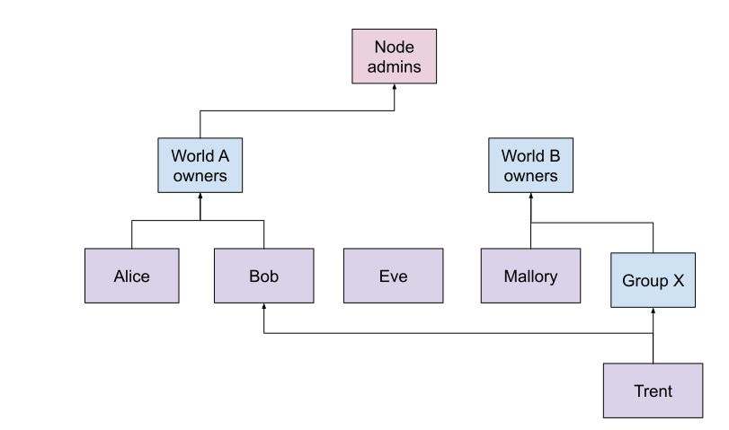
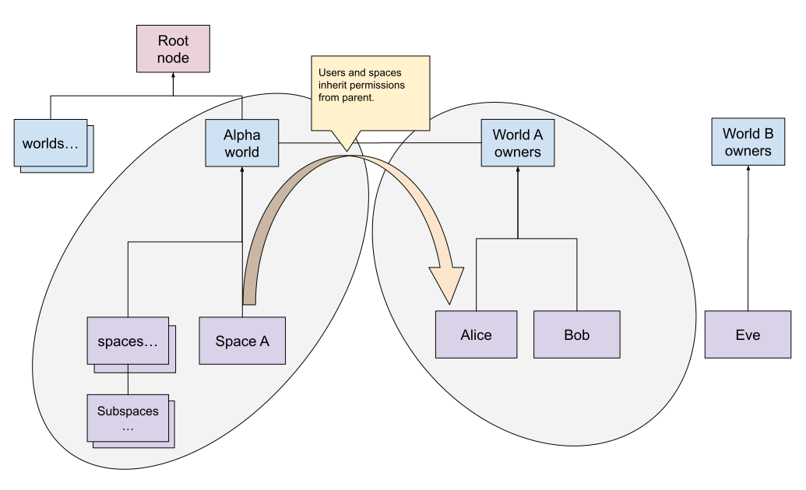

# Odyssey domain model

This is the abstract, high level, model which is the foundation for the actual data model and the whole application.

The base model for the data in the application is a very generic model, so that it is flexible to support many types of worlds/use cases. This means this model doesn’t contain any world specific entities, but everything is built around types that can be configured for each world.

The simplified model of the main entities is:

[comment]: # (https://docs.google.com/drawings/d/1at4ZBDjI00OIFRPuWwsMHqmMF8RRRa08-Vn-AtUrMzk/edit?usp=sharing)

So space and user each have a type and a recursive relation. This relation is used to create a tree-like hierarchy as the model in a world.

## Space hierarchy

The root of this tree is a special space with the ‘Node’ type (which maps to a server/hosting environment where multiple worlds can be located). Children linked to this node are the space entities with the ‘world’ type. Everything underneath a world is configurable for each world.

An example hierarchy of spaces could end up looking like this:

[comment]: # (https://docs.google.com/drawings/d/1BT7DdrvOkeWWqU2hRL2A2jdBBHR_rIlWloJJXBhHvrE/edit?usp=sharing)

Each `spaceType` defines what type of children are allowed (so one or more `spaceTypes`, another recursive relation). The world being a `spaceType` itself allows a world to configure which spaces are allowed directly underneath it. Every allowed `spaceType` underneath it does the same for its children, creating a controlled hierarchy of objects in the world.

## User hierarchy

The user model uses this structure to group users together. This is then used to create a role/permission model. This differs from the parent-child space model in that there is not necessarily a single root node and users can be connected to multiple ‘parent’ users. 

An example hierarchy of users:

[comment]: # (https://docs.google.com/drawings/d/1PilXhPe2aF9EmCAWeqPu79hLrCUUlMvurGKZZ5N1Xc4/edit?usp=sharing)

Users are initially created without any connection. But can then later be added as a member of another user. Meaning in this model the user entity is also used as a Group or Role and through this structure can inherit their membership/roles. So in the above example ‘Bob’ is a member of the ‘World A owners’, but through that relation also a member of the ‘Node admins’.  ‘Trent’ is a member of ‘Bob’ so is a member of the same things. But is also a member of ‘Group X’ and thus a ‘World B owner’.

## User space membership

Between the main two entities is a many-to-many relationship. This relationship facilitates the permission model. Users can be made a ‘space member’ of a certain space. This relation currently has a single additional property (`isAdmin`) that allows an ‘admin’ role to be defined.

If a user has the admin role for a space, it is also considered to be an admin for all the children spaces underneath it. Since a node is also a space, giving somebody the admin role for the node, gives them the superpowers to administer *all* the worlds and their spaces on a node. 

This same mechanism can be used by a world owner to give specific users administrative powers over a specific part of the world.

The user hierarchy can be used to ease maintaining these permission roles, by creating special users that act as roles or groups, so permission can be given to a single entity. After that users only need to be added as a member and will get _all_ the configured permissions.

[comment]: # (https://docs.google.com/drawings/d/1k080zS7_IeNzkreINazEwtvJok9X6i0kZ_XFFs8jk5Y/edit?usp=sharing)

Example to look up the members (or admins) of a space:
Check the space membership, walking 'up' the space hierarchy and for each user walk 'down' the user hierarchy to find all the users.

Example to look up the spaces of a user:
Check user membership parents, walking 'up' the user hierarchy and for each user check the space user membership and walk 'down' the space hierarchy to find all the spaces.

## Space types

The type of a space is used for two things: Control the usage and constraints of a group of spaces and provide default values for individual spaces, which can be overridden.

## User types

Controls who and how the users are managed (e.g., end user accounts vs. automatically generated ‘system’ users, which are used as groups or roles).