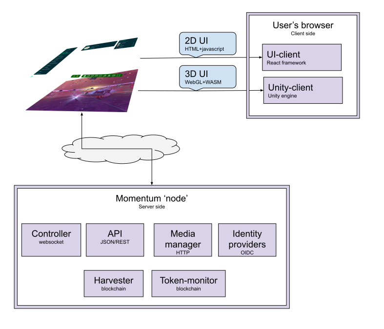

# Odyssey software stack

High level overview of the different parts of the Odyssey application.

[comment]: # (https://docs.google.com/drawings/d/1coUAALL0HqD2DUdqWUQWi5p2p509StLqORKcBMJMIIo/edit?usp=sharing)

Odyssey is a web application accessible by any modern web browser.

## Frontend

The web interface consists of two main parts: a 2D interface layer that sits on top of a 3D canvas. The 2D interface is built with the [React framework](https://reactjs.org/) - which is a commonly used, open source, framework for web applications. The 3D interface uses the[ Unity engine](https://unity.com/), a well known cross-platform, proprietary game engine.

These communicate with backend services running on some hosting environment somewhere on the internet.

## Backend

The _API_ provides a service to retrieve ‘bulk’ data, mainly used by the 2D interface to get information about the world which the user is currently in. This is served in a common, open format (the OpenAPI specification).

The _controller_ provides a service for real time updates of data. Any changes to the world are ‘pushed’ to all the clients/users. This is mainly used by the 3D interface to show changes in a world, as well as to keep all user positions updated. This uses a custom protocol, using a WebSocket connection, to efficiently transfer data.

The _media manager_ serves ‘large’ files to the browsers, like images, textures and music.

Authentication (logging in) is done through the _identity providers_ (currently *guest* and *Polkadot web3 wallet*).

The ‘outward’ facing services like the Controller and the API themselves communicate with internal services. The _harvester_ and _token-monitor_ get data from blockchain networks and provide these for use by the other services. The harvester provides general data for specific blockchains, like real time updates of blocks. The token-monitor monitors specific tokens/NFTs/smart contracts for use as authorization in the world.

