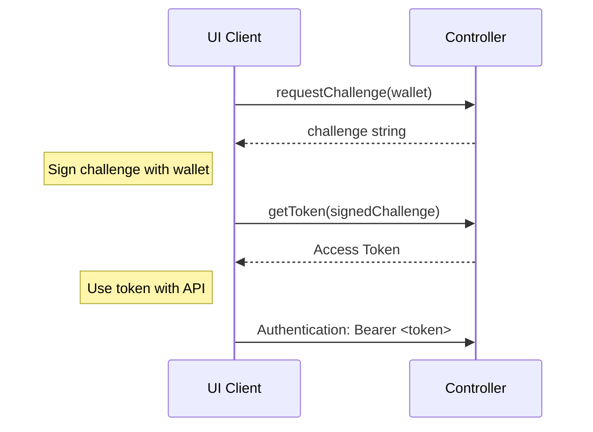

# Blockchain in Odyssey - Tech Design

At Odyssey platform the blockchain is used to store the data about the ownership and the relationships between the users and the Odysseys (3D worlds).

Odyssey ownership is stored in the form of ERC721 tokens, that are non-fungible tokens (NFT), which means that each token is unique and can be identified by its ID. The NFT is owned by the user's wallet address.

Users can own zero or more NFTs, which represent their ownership of the Odysseys.

Users can stake into the Odyssey NFTs to earn rewards and express their interest. The staking is done by locking the ERC721 tokens in the Odyssey smart contract. The staking is done by the user's wallet address.

## Blockchains and Wallets

We plan to support following blockchains:

- Ethereum baselayer
- Polygon PoS chain
- Arbitrum Nitro
- Arbitrum Nova
- Optimism

...and following wallets:

- Metamask
- Coinbase Wallet
- Polkadot.js (legacy)

We're interested in the transactions that our users are part of and the amount of tokens that they hold - useing the list of their wallets addresses.

## Authentication

## Connect multiple wallets to one account

**TODO**

## Harvester and unified way of working with blockchains

Backend will have a Harvester subsystem, whose job will be to connect our system to multiple blockchains and monitor the blocks minted, while generating internal events allowing us to monitor the wallets and contracts of interest to us.

They will be stored in the database and used to generate the data for the API and possibly real-time events allowing the UI client to react in a seamless manner.

**TODO flow diagram**

## Working with wallets extensions in UI client

The UI Client will have a unified way of working with the wallets having them implement an interface with following functions:

- getWallets() - _list of wallets_
- signRaw(string, wallet) - _sign challenge string using a wallet_
- signAndTransmit() - _performing transactions like staking. Not yet clear how achievable it it for unification_

...and properties:

- name
- logo

This way adding new integration should be without changing much mode, by implementing the interface.

It could later be done as special UI plugin once Odyssey plugin infrastructure is more mature.
