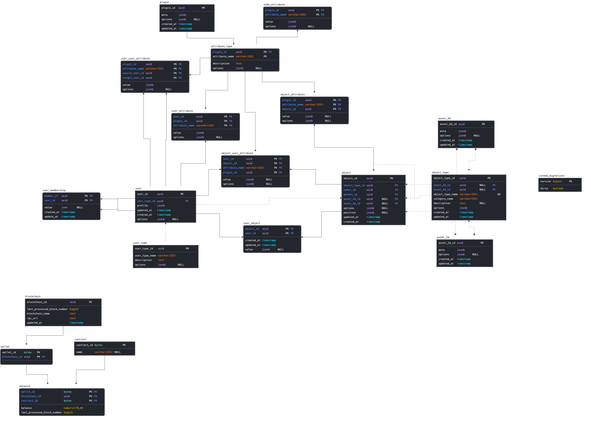

# Introduction
Odyssey uses a relational PostgreSQL database to store the state of Odysseys and its users.
Each Odyssey node/hosting environment uses a single database to store the state of multiple Odysseys.

## Tables
The _momentum4_ database contains multiple database tabels and their associated relationships.
An overview of all the tables and their relations can be found on the schema below:

Tables concerning the harvester are unrelated to the rest of the schema.

*More information: [Harvester](harvester.md)*

An overview of tables and their definitions can be found on the table below: 

| Table                 | Description                                                                                                     |
|-----------------------|-----------------------------------------------------------------------------------------------------------------|
| asset_2d              | 2d-asset IDs, these can be assets related to plugin functionality such as Miro or GDrive                        |
| asset_3d              | 3d-asset IDs, for rendering 3D assets in the Unity Client                                                       |
| attribute_type        | Generic attribute types, these are used to give entities such as objects additional attributes                  |
| balance               | Current balance state for a wallet and contract on a specific blockchain                                        |
| blockchain            | Blockchain related information, as well as the last processed block on a specific chain                         |
| contract              | Contract IDs and their names                                                                                    |
| node_attribute        | Attributes that are required in order to launch a new Node                                                      |
| object                | Basic object related data such as IDs, and IDs of their owners (users) and parent objects                       |
| object_attribute      | Additional attributes linked to object IDs                                                                      |
| object_type           | Type of object, i.e Skybox                                                                                      |
| object_user_attribute | Additional attributes related to objects _and_ users                                                            |
| plugin                | Basic data concerning plugins                                                                                   |
| schema_migrations     | Most up to date schema, _(correlates with internal SQLDBM version)_                                             |
| user                  | User and profile information                                                                                    |
| user_attribute        | Additional attributes linked to user IDs                                                                        |
| user_membership       | <mark>Todo: Do we still user this??</mark>                                                                      |
| user_object           | Table used to determine relation between an object and a user, also used as a preliminary access control system | 
| user_type             | Type of user, i.e Temporary User (unregistered)                                                                 |
| user_user_attribute   | Attributes related to two users, i.e registered high_fives                                                      |
| wallet                | Wallets with their corresponding blockchains                                                                    |

## Procedures
...

<mark>Todo: Explain procedures and their function</mark>

### Objects, users and permissions:
See the documentation about the [main domain model](../domain-model/).

### Dashboards
A _object_type_ has an ui_type, which a object instance can override, to specify the (2d) user interface that is shown when a user interacts with it. So (currently) an ui_type represents a 2D dashboard with ‘tiles’. A column in _object_type_ defines the default tiles that are created.

### Token gated access
Access to a object can be controlled with ‘tokens’ on a blockchain. A blockchain is monitored for changes for certain tokens and the user accounts that own these tokens are then given permissions. The _token_rules_ table defined the rules applied to a token defined in the _token_ tables. It supports different blockchain, which are defined in the _networks_ table. The permissions are regulated by the user_id column which points to a user entity which acts as a Group. The actual end user entities (which have an entry in _user_wallets_ that own the tokens) are then made a member of this user group.