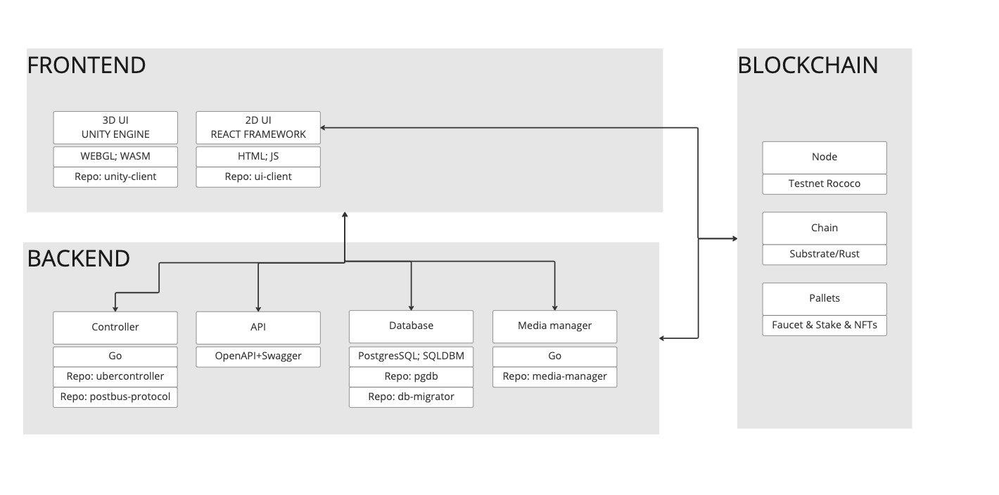
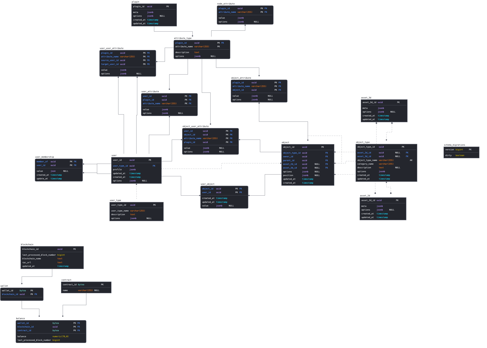

This document provides a quick high level overview of the architecture and system behind Odyssey that we hope to be building with you. This is a living document that will be updated and expanded, so keep and eye on it!

#  UX/UI
Our design team creates the Odyssey magic with the help of Figma. Check out our [MVP screens & components](https://www.figma.com/file/ThjIFEkvWGdAqrsb08t5Xz/Momentum-3.0-Design-System?node-id=334%3A15178&t=siREax3Pqbkgt7vi-0)

Stay tuned for Odyssey design system ... 

# Architecture 
A high level of the architecture components behind Odyssey 

### Frontend
The web interface consists of two main parts: 
- A 2D interface layer that sits on top of a 3D canvas. The 2D interface is built with the  [React framework](https://reactjs.org/)  - which is a commonly used, open source, framework for web applications. 
- The 3D interface uses the [Unity engine](https://unity.com/), a well known cross platform, proprietary game engine.

These communicate between each other and with backend services running on some hosting environment somewhere on the internet. 

*Check our repos: [GitHub (ui-client)](https://github.com/momentum-xyz/ui-client) ;  [GitHub (unity-client)](https://github.com/momentum-xyz/unity-client)*

### Controller (ubercontroller)
The _controller_ provides a service for real time updates of data. Any changes to the Odysseys are ‘pushed’ to all the clients/users. This is mainly used by the 3D interface to show changes in an Odyssey, as well as to keep all user positions updated. This uses a custom protocol, using a websocket connection, to efficiently transfer data. The controller also holds the authentication flow behind Odyssey (currently as a guest and polkadot web3 wallet)

*More information: [Ubercontroller](ubercontroller.md)*  
*Check our repo: [GitHub](https://github.com/momentum-xyz/ubercontroller)*

### API
The _API_ provides a service to retrieve ‘bulk’ data, mainly used by the 2D interface to get information about the Odyssey which the user is currently in. This is served in a common, open format (the OpenAPI specification + Swagger for implementation) [Odyssey API documentation](https://discover.odyssey.org/api/develop/)

*Check our repo: [api]([https://github.com/momentum-xyz/ui-client](https://github.com/momentum-xyz/ui-client/tree/develop/packages/app/src/api))*

### Media Manager
The _media manager_ serves ‘large’ files to the browsers, like images, textures, 3D assets and music.

*More information: [Media Manager](media-manager.md)*  
*Check our repo: [GitHub](https://github.com/momentum-xyz/media-manager)*

### Blockchain network
Our blockchain is Substrate (Rust) based parachain running on an local testnet. Testnet is a Local Relay ( 6 Nodes Rococo Local)+Parachain (5 Nodes Testnet-local). The Momentum parachain is based on the substrate parachain template + custom Stake and Faucet pallets. Our native token is $MOM (Momentum)

*Check our repos: [GitHub](https://github.com/momentum-xyz/drive); [testnet](https://github.com/momentum-xyz/drive_server)*

#### Harvester
The Harvesters job is to keep track of balances and transactions of tokens between wallets.

*More information: [Harvester](harvester.md)*

### Database
Below you can have look at out database schema that shows how our data is organized & the relationships inside

*More information: [Database](database-tables.md)*

