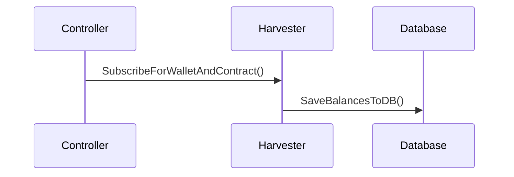

This document provides a high level overview of the architecture and system behind Odyssey that we hope to be building with you. This is a living document that will be updated and expanded, so keep and eye on it!

# Introduction
At Odyssey, the blockchain is used to store the data about the ownership and the relationships between the users and the Odysseys (3D worlds).

Ownership is stored in the form of ERC721 tokens, that are non-fungible tokens (NFT), which means that each token is unique and can be identified by its ID. The NFT is owned by the user's wallet address.
The Harvesters job is to keep track of balances and transactions of tokens between wallets.

## Blockchains

We plan to support following blockchains:

- Ethereum baselayer
- Polygon PoS chain
- Arbitrum Nitro
- Arbitrum Nova
- Optimism

# Architecture 
A high level of the architecture components behind the harvester system can be seen on the diagram below.

```mermaid
classDiagram
    Harvester <.. GenericAdapter
    Harvester <.. BlockChain
    Harvester <.. CallBacks
    BlockChain .. Database
    class Harvester{
      ...
      main()
      harvester.NewHarvester()
      SubscribeForWallet()
      SubscribeForWalletAndContract()
      (...)
    }
    class GenericAdapter{
      GenericAdapter
      ...
      Run()
      NewGenericAdapter()
      GetLastBlockNumber()
      GetBalance()
      (...)
    }
    class BlockChain{
      BlockChain
      ...
      NewBlockchain()
      ToEntry()
      SubscribeForWalletAndContract()
      GetBalanceFromBC()
      SaveBalancesToDB()
      LoadFromDB()
      (...)
    }
    class Database{
      NodesDB
      WorldsDB
      ObjectsDB
      ...
      GetObjectByID()
      UpsertObject()
      (...)
    }
    class CallBacks{
        Callbacks
        ...
        NewCallbacks()
        Add()
        Remove()
        Trigger()
        (...)
    }
```

### Core (ubercontroller)
The harvester core lives in its own package 'harvester', this package also contains the harvester adapters.
harvester.go acts as a generic interface for executing actions involving an adapter.

#### Harvester functions
A grasp of the available harvester functions can be found below, these functions can be called from within the _ubercontroller_.

```go
SubscribeForWalletAndContract(bcType string, wallet []byte, contract []byte, callback Callback)
``` 
May be called to listen to a certain wallet and contract combination. Where bcType an be any blockchain type as specified in the _bctypes.go_ package.
This function appends the current wallet and contract state to the database.

```go
RegisterBCAdapter(uuid uuid.UUID, bcType string, rpcURL string, adapter BCAdapter)
```
May be called to register a new BlockChainAdapter provided the type exists in the bcTypes package.

```go
Subscribe(bcType string, eventName HarvesterEvent, callback Callback)
```

Subscribes to a new harvester event, a list of events can be found in _events.go_.

```go
Unsubscribe(bcType string, eventName HarvesterEvent, callback Callback)
```

Unsubscribes from a harvester event.

### Adapters
Adapters are responsible for connection to a certain blockchain, the Run() function is called from main.go to initiate a new websocket connection to a specific chain.
Chain adapters can be seen as plugins.

### Events
These events can trigger a callback depending on the events listed in the table below:

| Name            | Description                       |
|-----------------|-----------------------------------|
| OnBalanceChange | When a wallet balance has changed |
| OnNewBlock      | When a new block is active        |


#### Keeping balances
Depending on what contract the wallet is set up to listen to, the harvester will keep track of the state of the wallets that are involved in the transaction.

<mark>Describe general events flow</mark>

#### Example
An example sequence diagram of what happens after the harvester subscribes to a wallet and contract can be found below:



### Database
In order to keep track of the current state of wallets and their balances. They are synchronized with the database. For this, a separate database structure exists as can be seen on the figure below.


The _blockchain_ table contains all the data necessary to connect to a certain chain.
Table _wallet_ is a pivot table to link a wallet to a specific chain ID.
The _balance_ table contains the balance of the wallet, and the last processed block number. This number can be used to assess where-ether the harvester is synchronized correctly.
Finally the _contract_ table contains