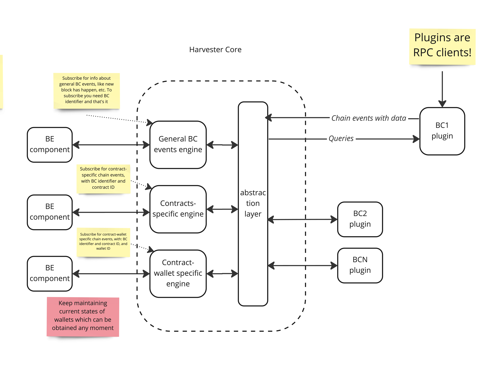
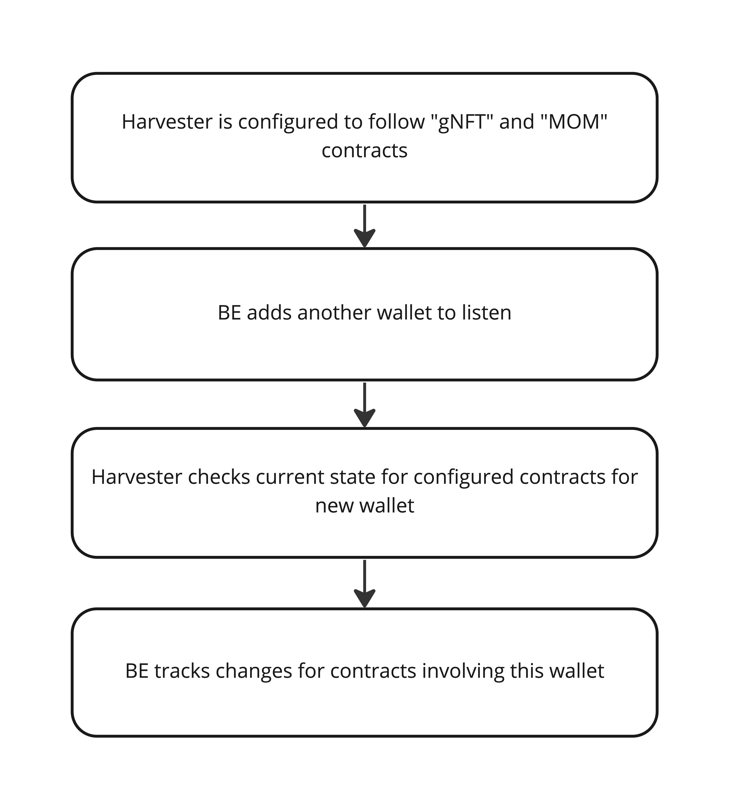
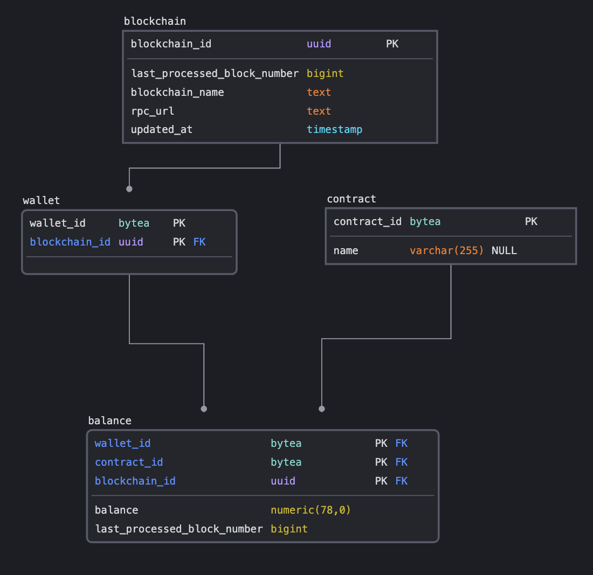

This document provides a high level overview of the architecture and system behind Odyssey that we hope to be building with you. This is a living document that will be updated and expanded, so keep and eye on it!

#  Introduction
At Odyssey, the blockchain is used to store the data about the ownership and the relationships between the users and the Odysseys (3D worlds).

Ownership is stored in the form of ERC721 tokens, that are non-fungible tokens (NFT), which means that each token is unique and can be identified by its ID. The NFT is owned by the user's wallet address.

The Harvesters job is to keep track of balances and transactions of tokens between wallets.

# Architecture 
A high level of the architecture components behind the harvester system can be seen on the figure below.

### Core (ubercontroller)
The harvester core lives in its own package 'harvester', this package also contains the harvester adapters.
<mark>Todo: core introduction</mark>

### Adapters
Adapters are responsible for connection to a certain blockchain, the Run() function is called from main.go to initiate a new websocket connection to a specific chain.
Chain adapters can be seen as plugins.

### Keeping balances
Depending on what contract the wallet is setup to listen to, the harvester will keep track of the state of the wallets that are involved in the transaction.

<mark>Describe general events flow</mark>

### Example

### Database
In order to keep track of the current state of wallets and their balances. They are synchronized with the database. For this, a separate database structure exists as can be seen on the figure below.

The 'blockchain' table contains all the data necessary to connect to a certain chain.
Table 'wallet' is a pivot table to link a wallet to a specific chain ID.
The 'balance' table contains the balance of the wallet, and the last processed block number. This number can be used to assess where-ether the harvester is synchonized correctly.
Finally the 'contract' table contains