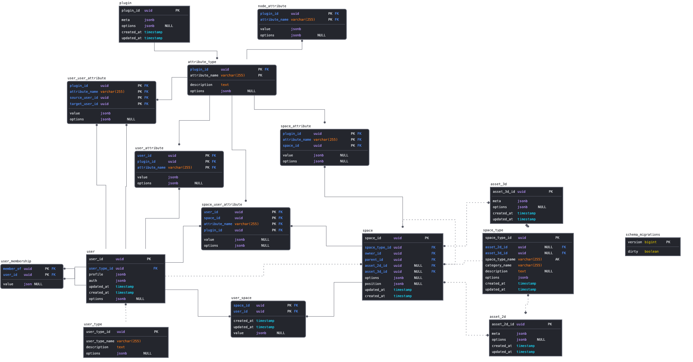

This document provides a quick high level overview of the architecture and system behind Odyssey that we hope to be building with you. This is a living document that will be updated and expanded, so keep and eye on it!

#  Introduction
At Odyssey platform the blockchain is used to store the data about the ownership and the relationships between the users and the Odysseys (3D worlds).

Odyssey ownership is stored in the form of ERC721 tokens, that are non-fungible tokens (NFT), which means that each token is unique and can be identified by its ID. The NFT is owned by the user's wallet address.

The Harvesters job is to keep track of balances and transactions of tokens between wallets.

# Architecture 
A high level of the architecture components behind the harvester system 

### Controller (ubercontroller)
The _controller_ provides a service for real time updates of data. Any changes to the Odysseys are ‘pushed’ to all the clients/users. This is mainly used by the 3D interface to show changes in an Odyssey, as well as to keep all user positions updated. This uses a custom protocol, using a websocket connection, to efficiently transfer data. The controller also holds the authentication flow behind Odyssey (currently as a guest and polkadot web3 wallet)

*Check our repo: [ubercontroller](https://github.com/momentum-xyz/ubercontroller)*

### API
The _API_ provides a service to retrieve ‘bulk’ data, mainly used by the 2D interface to get information about the Odyssey which the user is currently in. This is served in a common, open format (the OpenAPI specification + Swagger for implementation) [Odyssey API documentation](https://discover.odyssey.org/api/develop/)

*Check our repo: [api]([https://github.com/momentum-xyz/ui-client](https://github.com/momentum-xyz/ui-client/tree/develop/packages/app/src/api))*

### Media Manager
The _media manager_ serves ‘large’ files to the browsers, like images, textures, 3D assets and music.

*Check our repo: [media-manager](https://github.com/momentum-xyz/media-manager)*

### Blockchain network
Our blockchain is Substrate (Rust) based parachain running on an local testnet. Testnet is a Local Relay ( 6 Nodes Rococo Local)+Parachain (5 Nodes Testnet-local). The Momentum parachain is based on the substrate parachain template + custom Stake and Faucet pallets. Our native token is $MOM (Momentum)

*Check our repos: [token](https://github.com/momentum-xyz/drive); [testnet](https://github.com/momentum-xyz/drive_server)*

### Database
Below you can have look at out database schema that shows how our data is organized & the relationships inside

