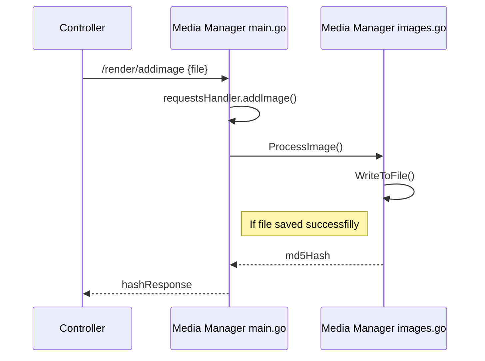

This document provides a high level overview of the architecture and system behind Odyssey that we hope to be building with you. This is a living document that will be updated and expanded, so keep and eye on it!

# Introduction

The media manager is responsible for saving and processing textures and assets such as user avatars or 3d-objects.
_ubercontroller_ contains an API-endpoint that can be used to upload a texture or asset to the media manager.

*Check the repo: [Media Manager]([https://github.com/momentum-xyz/media-manager](https://github.com/momentum-xyz/media-manger))*

## Media Manager API
The media manager generates MD5 hashes when an asset has been stored successfully. 
This hash can be used when fetching media from the media manager by calling its API.

An overview of available endpoints can be found on the table below.

| Method | Endpoint               | Description                                                         |
|:-------|------------------------|---------------------------------------------------------------------|
| GET    | /health                | Receives the current status of the media manager                    |
| GET    | /ready                 | Assesses where-ether the media manager is ready to process requests |
| POST   | /render/addimage       | Stores and processes an image                                       |
| POST   | /render/addframe       | Stores and processes a texture based frame                          |
| POST   | /render/addtube        | Stores and processes a thumbnail for YouTube previews               |
| POST   | /addtrack              | Stores and processes a new music track                              |
| DELETE | /deltrack              | Deletes a music track                                               |
| POST   | /addasset              | Stores and processes a 3D-asset                                     |
| GET    | /render/get/{hash}     | Fetches an image by md5-hash                                        |
| GET    | /render/texture/{hash} | Fetches a texture by md5-hash                                       |
| GET    | /render/track/{hash}   | Fetches a music track by md5-hash                                   |
| GET    | /render/asset/{hash}   | Fetches an object by md5-hash                                       |

## Example
An example diagram of how the media manager processes an uploaded asset can be found on the sequence diagram below.

