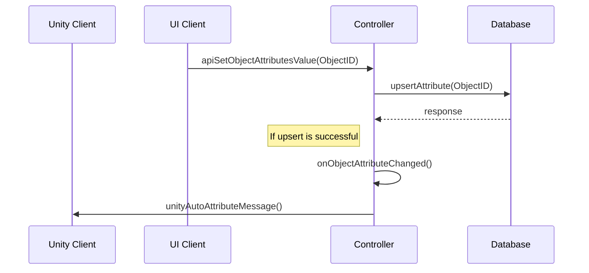
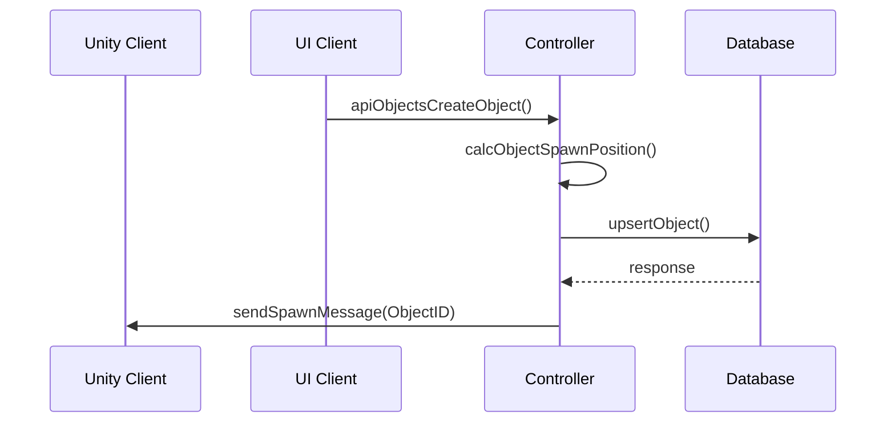
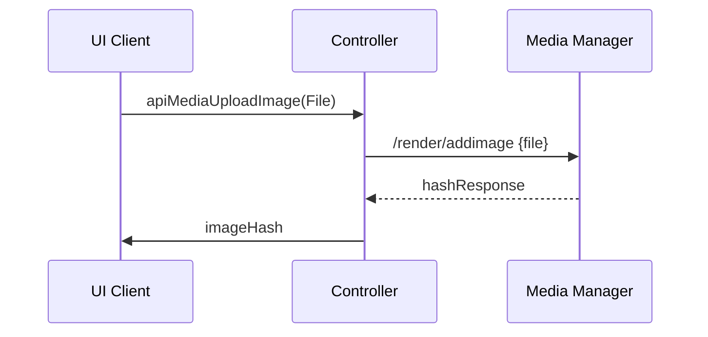
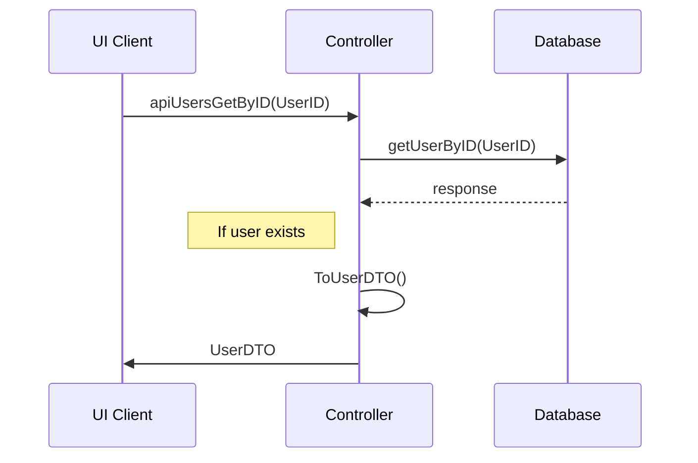

This document provides a quick high level overview of the architecture and system behind Odyssey that we hope to be building with you. This is a living document that will be updated and expanded, so keep and eye on it!

#  Introduction
The _ubercontroller_ provides a service for real time updates of data. Any changes to the Odysseys are ‘pushed’ to all the clients/users. This is mainly used by the 3D interface to show changes in an Odyssey, as well as to keep all user positions updated. This uses a custom protocol, using a websocket connection, to efficiently transfer data. The controller also holds the authentication flow behind Odyssey

*Repository: [ubercontroller]([https://github.com/momentum-xyz/ubercontroller](https://github.com/momentum-xyz/ubercontroller))*

## Architecture 
A high level of the architecture behind the ubercontroller can be found on the figure below:

<mark>Todo: architecture diagram?</mark>

## Universe

The 'universe' package contains all the logic related to an Odyssey. The universe can be seen as a collection of all objects in an Odyssey. 
The package also contains all the logic in order to mutate objects inside an Odyssey. 

Inside the universe package a number of sub-packages can be found, the sub-packages correspond with the database table names. And can be seen as the entities of an Odyssey.
Packages that require mutations from outside the application, contain api.go modules. These modules define API-methods used to mutate database data. i.e spawning a new object inside an Odyssey.

A file tree of the universe can be seen on the figure below.

```
├── universe
│   ├── asset2d
│   │   └── asset2d.go
│   ├── asset3d
│   │   └── asset3d.go
│   ├── assets2d
│   │   ├── api.go
│   │   └── assets2d.go
│   ├── assets3d
│   │   ├── api.go
│   │   └── assets3d.go
│   ├── attribute_type
│   │   └── attribute_type.go
│   ├── attribute_types
│   │   ├── api.go
│   │   └── attribute_types.go
│   ├── calendar
│   │   └── calendar.go
│   ├── iot
│   │   └── iot.go
│   ├── logic
│   │   ├── api
│   │   ├── dto
│   │   ├── middleware
│   │   └── logic.go
│   ├── interfaces.go
│   ├── node
│   │   ├── api.go
│   │   └── node.go
│   ├── singletons.go
│   ├── object
│   │   ├── object.go
│   │   ├── objects.go
│   │   └── users.go
│   ├── object_type
│   │   └── object_type.go
│   ├── object_types
│   │   ├── api.go
│   │   └── object_types.go
│   ├── plugin
│   │   └── plugin.go
│   ├── plugins
│   │   ├── api.go
│   │   ├── api_plugins.go
│   │   └── plugins.go
│   ├── user
│   │   ├── message_loop.go
│   │   ├── network.go
│   │   ├── stats.go
│   │   └── user.go
│   ├── user_type
│   │   └── user_type.go
│   ├── user_types
│   │   ├── api.go
│   │   └── user_types.go
│   ├── world
│   │   ├── api.go
│   │   ├── users.go
│   │   ├── users_api.go
│   │   ├── world.go
│   │   └── world_api.go
│   └── worlds
│       ├── api.go
│       └── worlds.go
```

### Objects

Objects can be seen as every entity that exists inside an Odyssey. 
A universe is built up as a tree of objects, where the root object is called the _node_.
This node contains children that can be objects of various _object_types_ .

Objects always have a form of visibility. As seen on the table below:

| Type                                 | Description                                                        |
|--------------------------------------|--------------------------------------------------------------------|
| InvisibleObjectVisibleType _(0b00)_  | Should not be visible in React and Unity                           |
| ReactObjectVisibleType _(0b01)_      | Should only be visible in React (i.e in the Explorer)              |
| UnityObjectVisibleType _(0b10)_      | Should only be visible in Unity (i.e the skybox)                   |
| ReactUnityObjectVisibleType _(0b11)_ | Should both be visible in React and Unity (i.e a common 3d object) |

Objects are mutated by using API-calls, as seen in the [API documentation](https://discover.odyssey.org/api/develop/)

#### - Attributes

Attributes are always part of an object and plugin. Attributes can be seen as properties of an object they always have an _attribute_type_.
The _attribute_type_ determines the type of attribute that is to be associated with the object. i.e _name_ or _object_color_.


### Automatic handling of attribute changes (Unity auto)

In the event that an attribute has been added/edited/removed, _unity_auto.go_ and/or _posbus_auto.go_ process the changes automatically.
This is in order to ensure that all connected clients are able to reflect the requested changes.

A sequence diagram of the unity auto flow can be seen below:



## Database
Below you can have look at out database schema that shows how the data is organized. It also shows the relations between tables.


## API
The _API_ provides a service to retrieve ‘bulk’ data, mainly used by the 2D interface to get information about the Odyssey which the user is currently in. This is served in a common, open format (the OpenAPI specification + Swagger for implementation) [Odyssey API documentation](https://discover.odyssey.org/api/develop/)

*Check our repo: [GitHub]([https://github.com/momentum-xyz/ui-client](https://github.com/momentum-xyz/ui-client/tree/develop/packages/app/src/api))*

### Examples

A few example API-calls made from the ui-client can be found on the sequence diagrams below:

#### Creating an object



#### Uploading an image to the media manager



#### Fetching a user by UserID




## Media Manager
The _media manager_ serves ‘large’ files to the browsers, like images, textures, 3D assets and music.

*More info on media manager: [Media Manager](media-manager.md)*

## Plugins
Plugins are an integral part of making Odysseys expandable and customizable.
The plugin infrastructure is a work in progress, which will enable creatives to write their own customizations.

*More info on plugins: [Plugins](plugins.md)*

## Statistics
At the moment of writing, statistics collected by the uber controller are being deployed on a Grafana instance. You can reach this instance by browsing: https://stats.dev.odyssey.ninja/grafana

### Prerequisites
- InfluxDB

### Configuration
The following environment variables are required in order to connect to the influx instance, these variables need to be set in the config.yaml file.

Yaml Module: `influx`

| Variable | Description  |
|----------|--------------|
| url      | Instance url |
| org      | Organisation |
| bucket   | Bucket name  |
| token    | Influx token |
