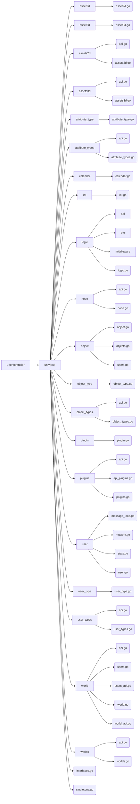
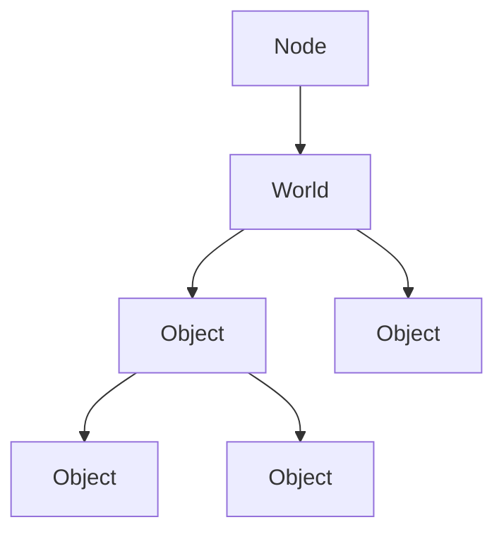
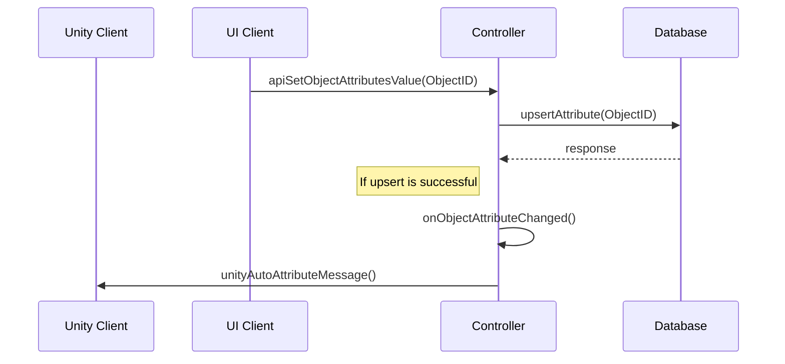
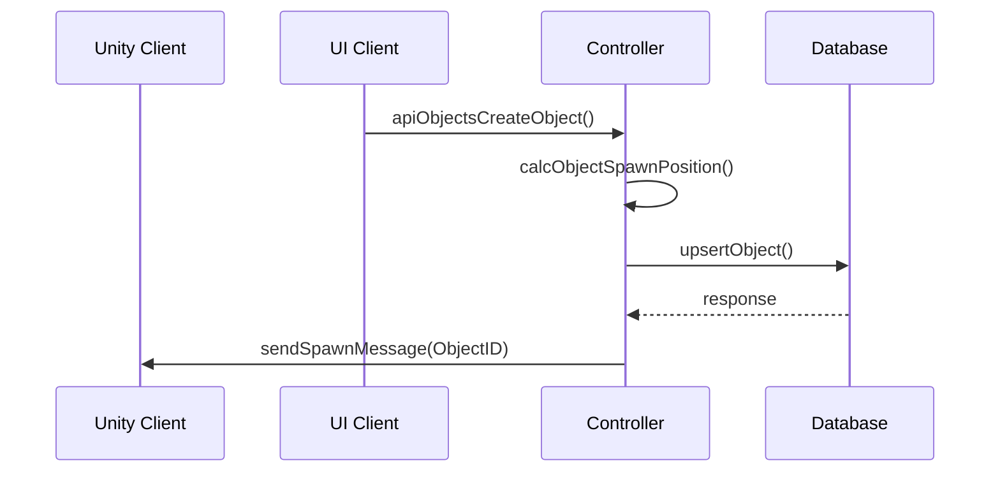
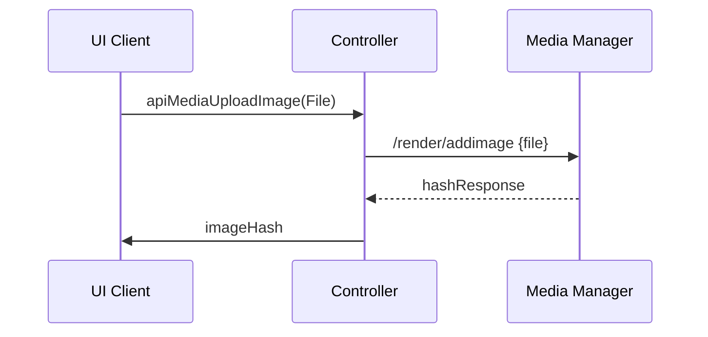
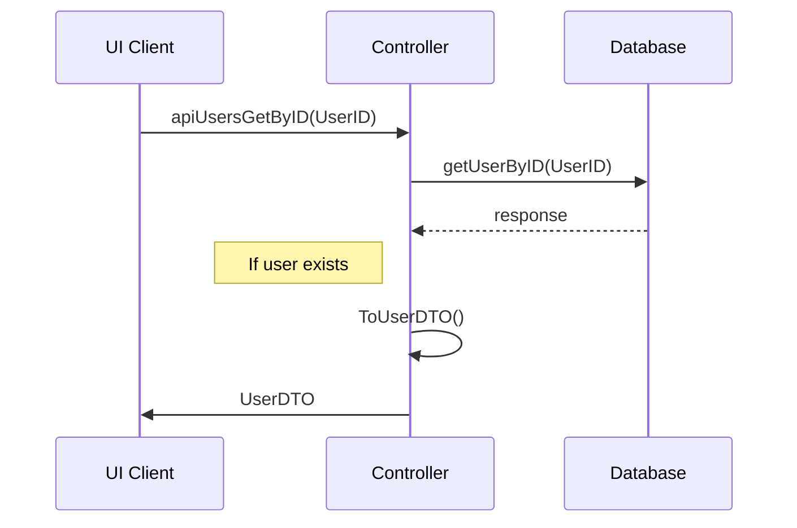
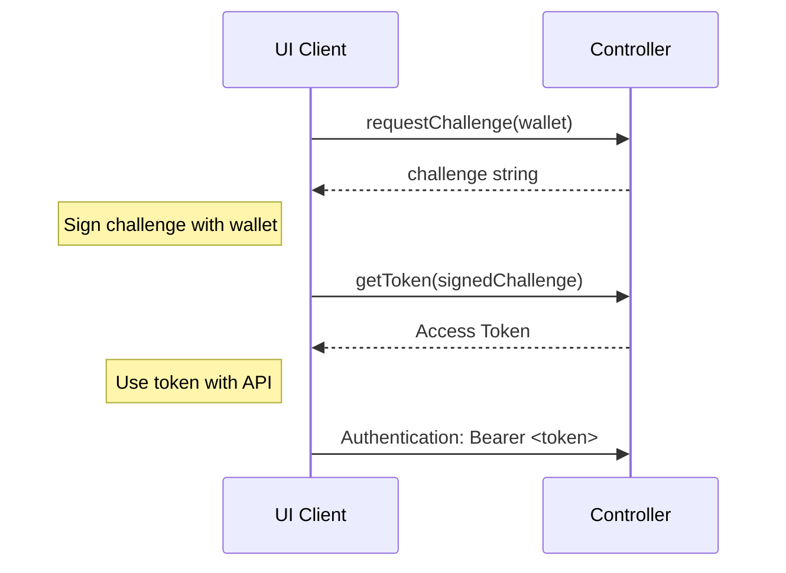
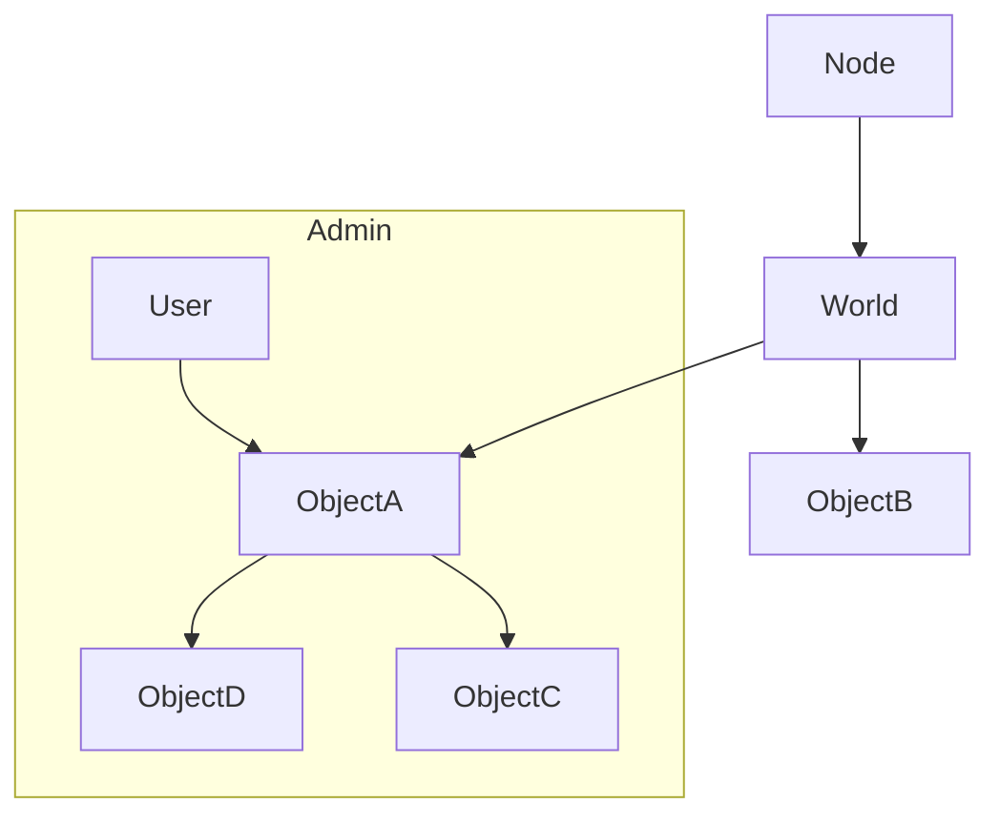

This document provides a quick high level overview of the architecture and system behind Odyssey that we hope to be building with you. This is a living document that will be updated and expanded, so keep and eye on it!

#  Introduction
The _ubercontroller_ provides a service for real time updates of data. Any changes to the Odysseys are ‘pushed’ to all the clients/users. This is mainly used by the 3D interface to show changes in an Odyssey, as well as to keep all user positions updated. This uses a custom protocol, using a websocket connection, to efficiently transfer data. The controller also holds the authentication flow behind Odyssey

*Repository: [ubercontroller]([https://github.com/momentum-xyz/ubercontroller](https://github.com/momentum-xyz/ubercontroller))*

## Architecture 
A high level overview of the architecture behind the ubercontroller can be found on the figure below:

```mermaid
classDiagram
    Core <|-- Universe
    Universe <|-- NodeAPI
    Universe <|-- WorldsAPI
    Core <|-- Database
    Database <|-- Universe
    Core <|-- Utils
    Database <|-- Seed
    Harvester <|-- EthereumAdapter
    Harvester <|-- BlockChain
    class Core{
      ...
      Main()
      Run()
      CreateDB()
      CreateNode()
      LoadNode()
      (...)
    }
    class Harvester{
      ...
      main()
      (...)
    }
    class EthereumAdapter{
      EthereumAdapter
      ...
      Run()
      NewEthereumAdapter()
      GetLastBlockNumber()
      GetBalance()
      (...)
    }
    class BlockChain{
        BlockChain
        ...
        NewBlockchain()
        ToEntry()
        SubscribeForWalletAndContract()
        GetBalanceFromBC()
        SaveBalancesToDB()
        LoadFromDB()
        (...)
    }
    class Database{
      NodesDB
      WorldsDB
      ObjectsDB
      ...
      GetObjectByID()
      UpsertObject()
      (...)
    }
    class Universe{
      Initializer
      Enabler
      Runner
      Stopper
      APIRegister
      ObjectsCacher
      Node
      World
      Object
      ...
      GetAllObjects()
      GetPosition()
      GetParent()
      GetName()
      RegisterAPI(r *gin.Engine)
      (...)
    }
    class NodeAPI{
      ...
      (n *Node) RegisterAPI(r *gin.Engine)
      (...)
    }
    class WorldsAPI{
      ...
      (w *Worlds) RegisterAPI(r *gin.Engine)
      (...)
    }
    class Seed{
      ...
      Run()
      SeedObjectTypes()
      SeedUsers()
      (...)
    }
    class Utils{
      ...
      BinID()
      MergeMaps()
      MapDecode()
      (...)
    }
```

Not all functions are included in this overview, but it should give an idea of how the _ubercontroller_ functions.

## Universe

The 'universe' package contains all the logic related to an Odyssey. The universe can be seen as a collection of all objects in an Odyssey. 
The package also contains all the logic in order to mutate objects inside an Odyssey. 

Inside the universe package a number of sub-packages can be found, the sub-packages correspond with the database table names. And can be seen as the entities of an Odyssey.
Packages that require mutations from outside the application, contain api.go modules. These modules define API-methods used to mutate database data. i.e spawning a new object inside an Odyssey.

A file tree of the universe can be seen on the diagram below.



### Synchronization

Entities are cached locally by the _ubercontroller_, this is done to improve response times and reduce overall overhead / latency between calls.
At run-time, the _ubercontroller_ synchronizes all its entities with the database. Any missing data will be added to its cache. 

### Objects

Objects can be seen as every entity that exists inside an Odyssey.
These can be mutated by using API-calls, as seen in the [API documentation](https://discover.odyssey.org/api/develop/)

#### Object visibily

Objects always have a form of visibility. As seen on the table below:

| Type                                 | Description                                                        |
|--------------------------------------|--------------------------------------------------------------------|
| InvisibleObjectVisibleType _(0b00)_  | Should not be visible in React and Unity                           |
| ReactObjectVisibleType _(0b01)_      | Should only be visible in React (i.e in the Explorer)              |
| UnityObjectVisibleType _(0b10)_      | Should only be visible in Unity (i.e the skybox)                   |
| ReactUnityObjectVisibleType _(0b11)_ | Should both be visible in React and Unity (i.e a common 3d object) |

#### Object hierarchy

A universe is built up as a tree of objects, where the root object is called a _node_ (which maps to a server/hosting environment where multiple worlds can be located).
This _node_ contains children that can be objects of various _object_types_. Children linked to a node are the object entities with the ‘world’ type. Everything underneath a world is an object configurable for each world.

An example hierarchy of objects could end up looking like this:



Each _object_type_ defines what type of children are allowed (so one or more _object_type_, another recursive relation). The world being a _object_type_ itself allows a world to configure which objects are allowed directly underneath it. 
Every allowed _object_type underneath it does the same for its children, creating a controlled hierarchy of objects in the world.

#### Object types

The type of an object is used for two things: Control the usage and constraints of a group of objects and provide default values for individual objects, which can be overridden.

#### Token gating

<mark>Todo: how does this relate to _user_membership_ at the moment?</mark>

Access to certain objects can be controlled with ‘tokens’ on a blockchain.
A blockchain is monitored for changes for certain tokens and the user accounts that own these tokens are then given permissions.
The token_rules table defined the rules applied to a token defined in the token tables. It supports different blockchain, which are defined in the networks table.
The permissions are regulated by the user_id column which points to a user entity which acts as a Group. 
The actual end user entities (which have an entry in wallets that own the tokens) are then made a member of this user group.

### Automatic handling of attribute changes (Unity auto)

In the event that an attribute has been added/edited/removed, _unity_auto.go_ and/or _posbus_auto.go_ process the changes automatically.
This is in order to ensure that all connected clients are able to reflect the requested changes.

A sequence diagram of the unity auto flow can be seen below:



## Database
Below you can have look at out database schema that shows how the data is organized. It also shows the relations between tables.


## API
The _API_ provides a service to retrieve ‘bulk’ data, mainly used by the 2D interface to get information about the Odyssey which the user is currently in. This is served in a common, open format (the OpenAPI specification + Swagger for implementation) [Odyssey API documentation](https://discover.odyssey.org/api/develop/)

*Check our repo: [GitHub]([https://github.com/momentum-xyz/ui-client](https://github.com/momentum-xyz/ui-client/tree/develop/packages/app/src/api))*

### Examples

A few example API-calls made from the ui-client can be found on the sequence diagrams below:

#### Creating an object



#### Uploading an image to the media manager



#### Fetching a user by UserID



## Authentication
Authentication (logging in) is done through _identity providers_. At the moment of writing this is done through polkadot.js.

Below is a sequence diagram that describes the current authentication flow:



We plan to support the following wallets in the (near)future:

- Metamask
- Coinbase Wallet
- Polkadot.js (legacy)

## Authorization

Authorization between users and objects currently take place using inheritance patterns.
An example of this involves the database table _user_object_, this table links users to objects.
All objects have parents, and are thus traversable. 

An example of how authorization inheritance works can be seen on the flowchart below:



When a user is admin of an object in the tree, the children of that object will also fall in the users admin scope.

## Media Manager
The _media manager_ serves ‘large’ files to the browsers, like images, textures, 3D assets and music.

*More info on media manager: [Media Manager](media-manager.md)*

## Plugins
Plugins are an integral part of making Odysseys expandable and customizable.
The plugin infrastructure is a work in progress, which will enable creatives to write their own customizations.

*More info on plugins: [Plugins](plugins.md)*

### Attributes

This provides plugins with a generic storage solution (for ‘simple’ key-value data), without the need to change the database schema.

The _attributes_ table defines which ones are available. These can then either be linked to objects or user _and _object (using the object_attributes or _user_objects_attributes_ m2m through tables) to give them a value. <br/>
Property _attribute_type_ determines the type of attribute that is to be associated with the object. i.e _name_ or _object_color_.

## Statistics
At the moment of writing, statistics collected by the uber controller are being deployed on a Grafana instance. You can reach this instance by browsing: https://stats.dev.odyssey.ninja/grafana

### Prerequisites
- InfluxDB

### Configuration
The following environment variables are required in order to connect to the influx instance, these variables need to be set in the config.yaml file.

Yaml Module: `influx`

| Variable | Description  |
|----------|--------------|
| url      | Instance url |
| org      | Organisation |
| bucket   | Bucket name  |
| token    | Influx token |
