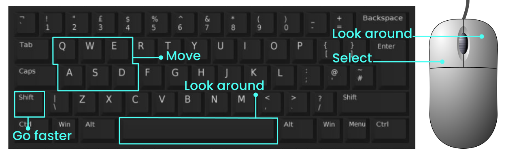

# Odyssey controls

In Odyssey, you use a combination of keyboard and mouse to move in the 3D space. Let’s see what they are.

|Key|Function|
|---|---|
| `W` | Move forward |
| `A` | Move left|
| `S` | Move backwards |
| `D` | Move right |
| `E` | Move up |
| `Q` | Move down |
| `SHIFT` | Go faster |
| `RMC (hold)` or `SPACE BAR (hold)` | Hold right mouse button or space bar to look around |
| `LMC` | Left mouse click to select objects |

