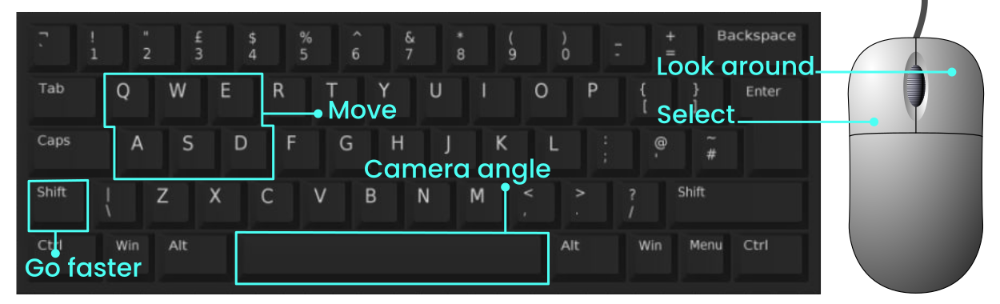

# First steps

We put together this page to swiftly walk you from the creation of your Odyssey all the way to placing your first object and connecting with others. 

Here you will find everything you need to get started.

## Connect your wallet

## The Explorer

When you navigate to [odyssey.org](https://odyssey.org) you are presented with the Explorer. Here you can see and explore other people’s Odysseys, visit them, and see their connections.

**Every dot on the screen is a whole 3D world**.

:::tip
Use the `Left Mouse Button` to click on an Odyssey and open its owner’s profile, hold it and drag the mouse to look around. Hold the `Right Mouse Button` and drag to pan the view, and the `Scroll Wheel` to zoom in and out.
::: 

## Create your Odyssey

Creating your Odyssey means minting your own 3D world (call it metaverse, if you like) on the blockchain. Right now, Odyssey is in alpha on testnet, but you can already build your own world and experience some of its features.

To create your Odyssey:

1. Make sure you have a Polkadot wallet (go [here](get-a-wallet) if you don’t have one)
2. Go to [odyssey.org](https://odyssey.org) and click on `Create your Odyssey`
3. Follow the rest of the flow (we have a [step-by step guide](the-birth-process))

:::caution
Odyssey is on testnet at the moment, so the creation process might take a few minutes. Please be patient and don’t refresh your browser!
:::

## Enter your Odyssey

You are now ready to start building!

After your Odyssey has been created, you will be returned to the Explorer page, to enter your Odyssey:

1. Click on your profile in the bottom-left corner of your screen
2. Click on `Visit`

Welcome to your Odyssey.

## Move around your 3D world

To move around, use the controls below, you can read a full description [here](controls.md)

## Place your first object

It’s time to unleash your imagination, let’s place a few objects in your Odyssey:

1. [Enter Creator Mode](/explore-the-features/odyssey-creator/enter-creator-mode.md) by pressing on the last icon in the bottom-right corner of your screen
2. Choose `Add Object` (the `+` icon) in the menu on the right edge of your screen
3. Choose *Cube with image* from the *Basic Asset Pack*
4. Give it a name and click `Spawn object`

## Wrap your cube in an image

Images are one of several functionalities you can assign to an object, it takes an image and wraps it around the geometry. This functionality works only with assets from the *Basic Asset Pack*.

1. While in Creator Mode, click on your cube
2. Choose `Functionality` from the horizontal menu that appears
3. Choose `Image` from the dropdown menu in the top-left corner of your screen
4. Exit Creator Mode by clicking on the `X` in the bottom-right corner of your screen
5. Click on the cube again and then on `Change image`
6. Choose `Select image` and pick an image from your computer
7. Click `Change` to confirm and close the image menu

:::tip
You can also pick a colour instead of an image, you can check out the instructions for that [here](/explore-the-features/odyssey-creator/spawning-assets.mdx#changing-the-colour-of-basic-objects)
:::

## Assign a functionality

Your cube can do much more than just floating in the middle of your Odyssey. Let’s make it play a video.

1. Enter Creator Mode
2. Click on your cube and choose `Functionality`
3. Choose `Video` from the dropdown menu in the top-left corner of your screen
4. Exit Creator Mode by clicking on the `X` in the bottom-right corner of your screen
5. Click on the cube again and then on `Change` in the window that appears
6. Paste the URL for a YouTube, Twitch, or Vimeo video and click `Save`

:::info
Notice that if you select an image before assigning the video functionality, the image is kept.
:::

## Upload your first custom 3D asset

Let’s move on to custom assets. To upload one:

1. Enter Creator Mode and choose `Add Object`
2. Click on `Upload Custom Object` and then on `Upload your asset`
3. Choose a *.glb* 3D model from your computer, give it a name and click `Add to library`
4. Wait for it to load, you will receive a notification on screen

## Use your custom asset

Let’s place your 3D object in your Odyssey:

1. Enter Creator Mode and choose `Add Object`
2. Click on `Custom Object Library` and search for your model. You can use the search bar in the top-left corner of the window
3. Click `Select` and proceed like you did when you spawned the cube

## Modify your objects

You can scale, move, and rotate objects from within Odyssey in just a few clicks:

1. Enter Creator Mode and click on the object you with to modify
2. Choose either `Move`, `Rotate`, or `Scale`
3. A gizmo (a tool with coloured lines) will appear, `click and drag` to modify your asset

:::info
When using the gizmos: red is the X-axis (left-tight), green is the Y-axis (back-forth), and blue is the Z-axis (up-down) 
:::

:::tip
You can dive deeper into the specifics of 3D object spawning and their format [here](/explore-the-features/odyssey-creator/spawning-assets.mdx). We also put together a few useful resources to get started with 3D modelling, or to find 3D models online [here](https://discover.odyssey.org/blog/quick-guide-to-3d-assets-for-your-odyssey/)
:::

## Connect with others

Let’s take now a look at how you can start building your own on-chain social network.

1. Navigate to the Explorer (if you are in your Odyssey, it’s the first button in the bottom-left corner of your screen)
2. Click on any Odyssey
3. The lines connecting different Odysseys are their connections
4. From the menu in the top-left corner, you can choose to `Visit` that Odyssey or `Connect`. Choose `Connect`
5. Click on `Start contributing`
6. Choose the amount of Momentum ($MOM) that you want to stake
7. Click `Sign & connect` and sign the transaction

You can already connect with other Odysseys on our testnet. Once $MOM is minted, this will open many earning possibilities and business models. As of now, if two people mutually stake in each other, they gain admin rights to both Odysseys, so they can co-create together (e.g. spawn and modify objects, assign functions, etc.).