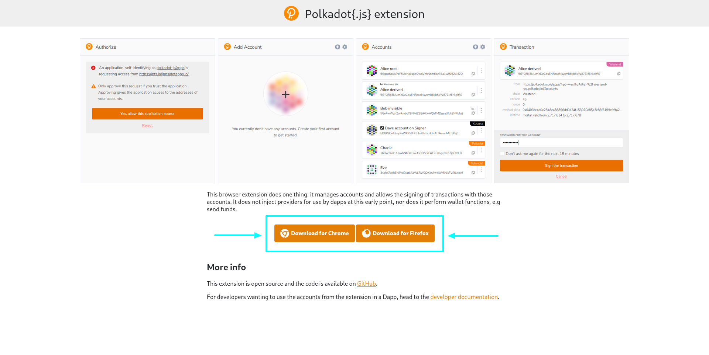
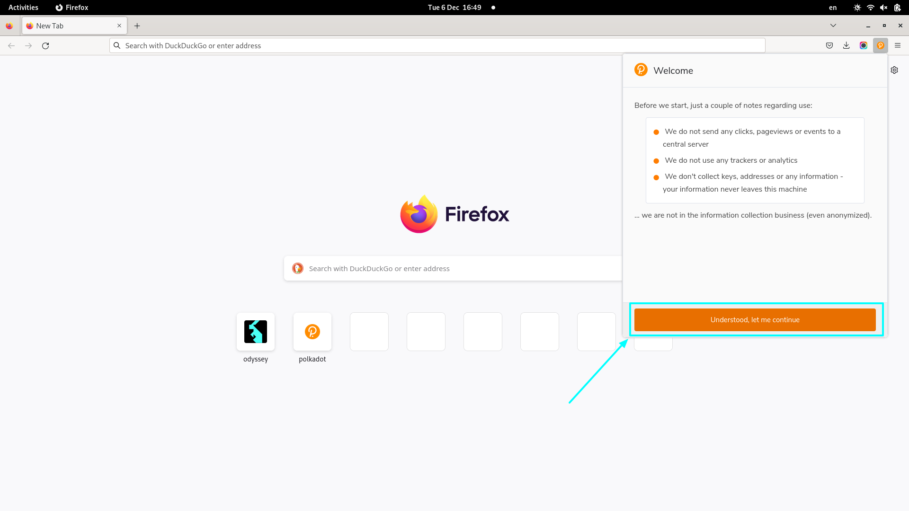
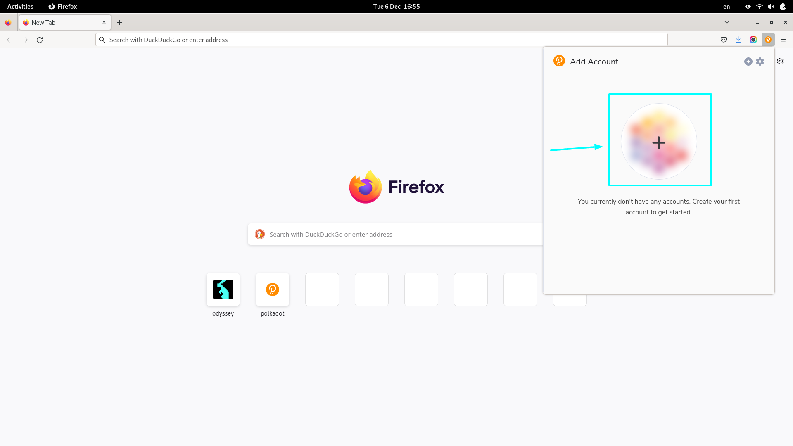
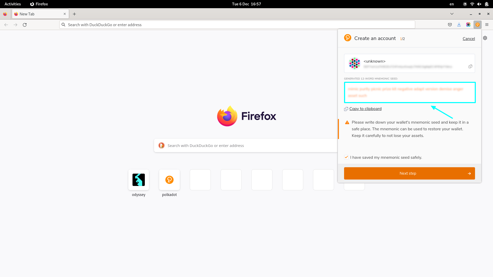
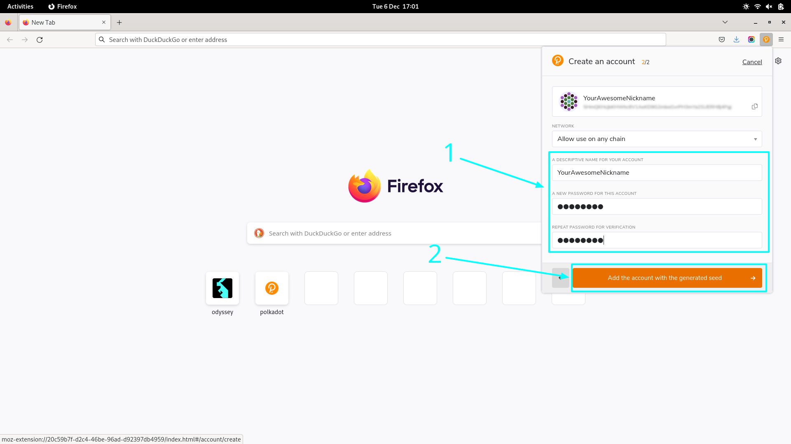

# Get a wallet

Odyssey is build on web3 technology, which means that you need a wallet to mint your Odyssey and access it. Don't have a wallet? You are in the right place!

Right now, we support only the polkadot{.js} wallet, available as a browser extension. Keep an eye out on our social channels because more wallets will be coming!

## Set up your polkadot{.js} wallet

There is nothing to worry about, this is an easy-peasy thing to do.

### 1. Download the wallet extension

polkadot{.js} works with Firefox or any Chromium-based browser (Google Chrome, Brave, etc.). Visit the [polkadot{.js} official extension page](https://polkadot.js.org/extension/) and choose your browser, then download and install the extension.

### 2. Read the cool stuff and continue

Web3 is all about leaving you ownership of your own data. Read what the wallet does (or, rather, doesn't do), and continue

### 3. Create your account

Awesome! You are almost there! A quick three-step process, and you'll have your very own polkadot{.js} wallet!

#### 1. Click on the BIG plus `+` button

#### 2. Write down your 12-word mnemonic seed (that the 12 random words in orange) somewhere safe! The tick the confirmation box and click on `Next step`

:::danger
If you lose your 12-word seed, you won't be able to recover your account in any way. This means that you might lose all your tokens and NFTs! So yeah, **DO NOT LOSE IT!**
:::

#### 3. Set a descriptive name (or an awesome nickname 😏) for your account, insert a strong password, and click the big orange button... You are done! 🥳 

... You are done! 🥳 

## Next steps

Awesome! The next step is minting your Odyssey. Don't worry, we have a tutorial for that, too!