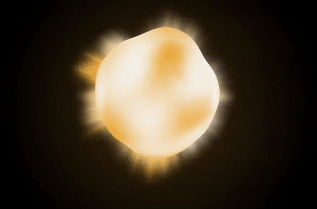

# The birth process

In order to start creating and expressing yourself in your own unique space, you need to give *birth* to it. Don't worry, it's not nearly as hard as it sounds!

## 1. Start the birth process

To start creating your own Odyssey's NFT, simply click on `Create your Odyssey`

## 2. Connect your wallet

Choose one of your available wallet and click on `Connect your wallet`. No wallet? Check [this tutorial](get-a-wallet.md)

## 3. Choose an image and an epic name

How are you going to name your Odyssey? What will be the first image people will see? That's up to you :blush:

## 4. Be patient...

It might take a little while for your Odyssey to be created (it's a *whole* world after all!), so please hang on and don't refresh your browser!

## 5. Wait for the awesome animation

Last bit! Hit the `Build your Odyssey` button and watch your Odyssey come to life...

## 6. Welcome to your Odyssey

Head over to the next section to explore the tools at your disposal.

Always remember, you decide the direction of Odyssey. If you have any feedback, [feel free to share it via our social channels](https://discover.odyssey.org/get-in-touch/)

