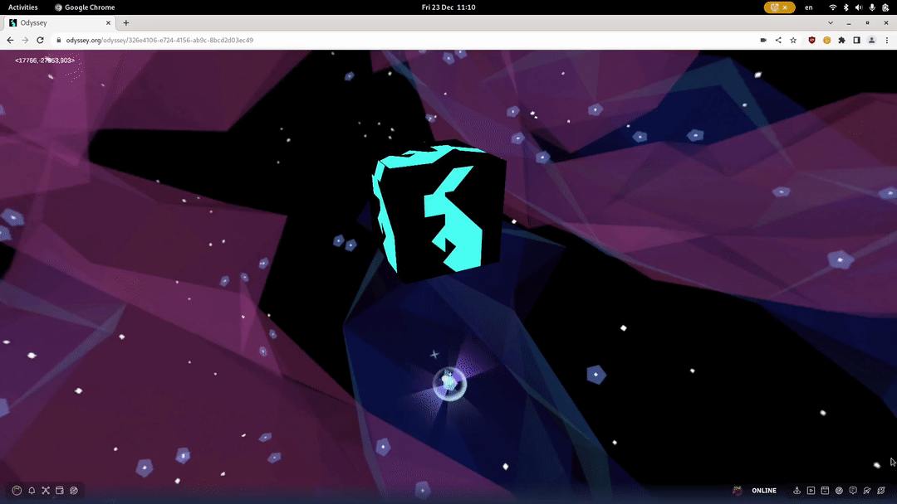

Everything that has to do with shaping the whole experience users have in your Odyssey starts from the *Odyssey Creator*. This includes changing skybox (the backdrop of your Odyssey), adding objects, manipulating them, and giving them all sorts of cool functions. 

## Enter Odyssey Creator mode

In order to enter Creator mode you need to simply click on the Odyssey Creator icon in the bottom-right corner.

You will see a tools panel on the left of your screen. If you want to modify an object, just click on it and start editing!

## Next steps

Awesome! Let's move to the next section, where the cool stuff is 😎