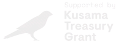

# Welcome to Odyssey

Welcome to Odyssey’s Docs. Here you can find everything you would need to get started with Odyssey. This includes setting up a wallet, your Odyssey account, getting tokens and Odyssey NFT, joining our community and developing the product further with us.

Odyssey is supported by:

&emsp;&emsp;

We wish you an epic adventure ahead!
If you have questions please join our community and we’d be happy to help 🪐

[Discord](https://discord.gg/6PH9nSu7UP)

[Twitter](https://twitter.com/odysseycreator)

[Telegram](https://t.me/odysseycreator)

## What is Odyssey?

Content Creation, Collaboration, and Community Building in 3D.

We enable creators who are eager to explore the digital format of 3D with intuitive interface & processes to craft and publish interactive 3D experiences in browser, together, as these stories unfold so we share knowledge networks and skills.

## Why Odyssey?

1- Accessible: No coding skills required to create content in 3D

2- Social: encourages sharing, collaborating, and connecting with others

3- User-generated and curated: Users actively create and curate content and earn with it

## What can I do with Odyssey?

You can accomplish three things:

1- Build your own 3D world, with custom assets, skyboxes, and functionalities.

2- Generate, program, and participate in collaborative experiences.

3- Leverage the power of tokenomics to earn from your creations, and support your network of Connections (our implementation of staking).

We enable these via three pillars:

1- The Odyssey Creator (a 3D World Builder, not dissimilar to what you find in MMORPGs like Minecraft)

2- A plugin infrastructure

3- The Momentum ($MOM) token

### Odyssey Creator

A multiplayer game-style world builder that allows you to place objects (both default and custom) in your Odyssey. You can also change the skybox (the backdrop of your Odyssey, which controls the vibe of your world).

The builder has all the standard features such as move, scale, and rotate objects. In addition, you can assign each object a specific functionality (e.g. add an image, video, or text; sound is coming soon).

### Plugin infrastructure

Odyssey is open-source, and we are implementing a plugin infrastructure to let everyone create the functionalities they need (think of it as WordPress plugins for your metaverse).

The power of the plugins is twofold:

1- Creators will gain tailored functionalities to create even more unique experiences, hence attracting more people

2- Developers will be able to create value for the community, while implementing their own earning mechanisms (e.g. tip-based, subscription, a fee per usage, one-time fee, etc.)

### Momentum token

$MOM (Momentum) is a **utility token** used both for paying network fees (e.g. minting your Odyssey) and for connecting to other Odyssey—our implementation of staking which yields both the staker and the stakee. Read more about $MOM further down.

## Get early access to Odyssey

Odyssey Beta is now live on testnet.

We’re bringing together a curated group of creators who are trying to reimagine the world through new technology. This curated group will be among the first to start experimenting with creating, collaborating, and building community in 3D.

Apply to get early access here: https://odyssey.org.

If you have any questions, don't hesitate to reach out to us on our [Discord](https://discord.com/invite/odysseycreator/)

